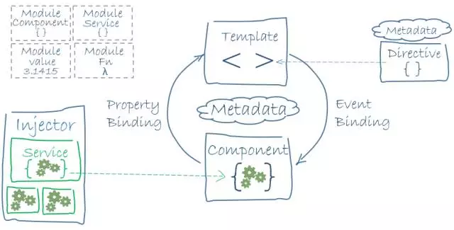

# 我为什么选择Angular 2？

没有选择是痛苦的，有太多的选择却更加痛苦。而后者正是目前前端领域的真实写照。新的框架层出不穷：它难吗？它写得快吗？可维护性怎样？运行性能如何？社区如何？前景怎样？好就业吗？好招人吗？组建团队容易吗？

每一个框架都得评估数不清的问题，直到耗光你的精力。这种困境，被称为“布利丹的驴子” —— 一只驴子站在两堆看似完全相同的干草堆中间，不知道如何选择，最终饿死了。

当然，那只是一个哲学寓言。现实中，大多数人采用了很简单的策略来破解它：跟风，选择目前最流行的那个。这是一个低成本高收益的策略，不过也有风险：成为现实版的《猴子下山》。最理想的方案还是要看出这两堆“干草”之间的差异，选择更适合自己的那个。

本文就将带你了解Angular 2这个“干草堆”的各种细节。

## ALL-IN-ONE

(图片来自宜家官网)

不管是1还是2，Angular最显著的特征就是其整合性。它是由单一项目组常年开发维护的一体化框架，涵盖了M、V、C/VM等各个层面，不需要组合、评估其它技术就能完成大部分前端开发任务。这样可以有效降低决策成本，提高决策速度，对需要快速起步的团队是非常有帮助的。

让我们换一种问法吧：你想用乐高搭一个客厅，还是买宜家套装？

Angular 2就是前端开发领域的“宜家套装”，它经过精心的前期设计，涵盖了开发中的各个层面，层与层之间都经过了精心调适，是一个“开箱即用”的框架。

当然，你可能还记着Angular 1带给你的那些快乐以及……痛苦。这是有历史原因的。由于它是从一个用来做原型的框架演化而来的，加上诞生时间很早(2009年，作为对比，jQuery诞生于2006年)，当时生态不完善，连模块化机制都得自己实现（这就是angular.module的由来，也是Angular 2中抛弃它的理由）。在长达七年的演化过程中，各种进化的遗迹非常明显，留下了不少“阑尾”。

但Angular 2就不同了，它的起点更高，整合了现代前端的各种先进理念，在框架、文档、工具等各个层面提供了全方位的支持。比如它的“组件样式”能让你在无需了解CSS Module的前提下获得CSS Module的好处，它的Starter工程能让你在无需了解Webpack的前提下获得Hot Module Replacement等先进特性，它能让你从Web Worker(你知道这是什么吗？)中获得显著的性能提升。

你只管在前台秀肌肉吧！剩下的，让Angular在幕后帮你搞定！

## 模块化的技术

虽然Angular是一个ALL-IN-ONE的框架，但这并不妨碍它同时是一个灵活的框架。还记得OCP(开闭原则)吗？一个好的设计，对扩展应该是开放的，对修改应该是关闭的。

Angular 2很好的践行了OCP原则以及SoC(关注点分离)原则。

它非常有效的分离了渲染与交互逻辑，这就让它可以很好的跟包括React在内的渲染引擎搭配使用，除此之外，它还可以使用内存渲染引擎，以实现服务端渲染；还可以使用Native渲染引擎，以编译出真正的原生程序(NativeScript)。

它还分离了数据供应与变更检测逻辑，从而让它可以自由使用包括RxJS以及ImmutableJS在内的第三方数据框架/工具。

不仅如此。

在Angular 1和Angular 2中最具特色的应该算是依赖注入(DI)系统了，它把后端开发中用来解决复杂问题、实现高弹性设计的DI技术引入了前端。Angular 2中更是通过引入TypeScript赋予它更高的灵活性和便利性。

不过，Angular 2并没有敝帚自珍，把它跟框架本身紧紧黏结在一起，而是把它设计成了一个独立可用的模块。这就意味着，无论你正在使用什么前端框架，甚至NodeJS后端框架，都可以自由使用它，并从中获益。

## 全生命周期支持

除非你打算写一个一次性应用，否则软件的生命周期会很长。宏观来看，真正的挑战来自多个方面，而且在不断变化。

开始的阶段，我们需要非常快速的建立原型，让它跑起来，引入最终用户来试用，这个时候，挑战来自开发速度以及可复用资产。

之后，会建立一个逐渐扩大的项目组，来完善这个原型的功能。主要的挑战是让这个原型通过重构不断进行演化，特别是在演化的后半个阶段，产品需要保持随时可以上线的状态。但技术上的挑战那都不是事儿！关键是人。

如何让新人快速融入项目组，贡献生产力？这可没那么简单。“你先去学xxx 0.5、yyy 0.9、zzz 5.3...还要了解它们前后版本之间的差异，我再给你讲代码”，这种话，我可说不出口。一个优秀的框架需要对分工提供良好的支持，每个人都可以先从一些简单任务开始，逐步的从修改一个文件扩大到修改一个目录再到独立实现一个特性。

有了这种分工，每个团队成员就可以从一个成功走向一个更大的成功。这就需要框架在设计上具有良好的局部性：你可以放心大胆的修改一部分，而不用担心影响另一部分。你可以只修改CSS，可以只修改HTML，可以只修改TS/JS，而不用担心自己的修改破坏了其他部分。而Angular 2通过声明式界面、组件样式以及独立模板文件等对这种安全感提供了有力的保障。

再然后，如果你的软件顺利的进入了线上维护阶段，那么恭喜你，你终于迎来真正的大Boss了！这个大Boss就是可维护性。Angular开发组有很多程序员来自Google，如果要问谁的软件维护经验最丰富，Google和微软必然名列前茅。微软通过TypeScript的强类型机制体现了自己的经验，而Google则通过将OCP、SoC、SRP等一系列软件设计原则融入Angular体现了自己的经验。具体技术上则体现为：DI、生命周期钩子、组件等等。

最后，如果你的软件完成了历史使命需要逐步退出，是不是就能松口气了？不行，你还得继续留人维护它。如果你选择的是一个闭源的或某个社区很羸弱的开源技术，你就把以前的主力架构师、资深程序员留下来继续维护它吧。或者你就得鼓起勇气跟用户说：你们玩儿，我先走了。而Angular是一个大型开源项目，并得到了Google的鼎力支持。即使经历过Angular 2项目组初期的公关失败，它仍然有着其它竞品无法企及的繁荣社区 —— 无论在全球还是在中国。显然，无论是对传统社区资源的继承，还是对新社区资源的开拓，我们都有理由相信，Angular社区仍将一如既往地繁荣。至少，如果你不想让自己的软件建立在一大堆由个人维护的核心库上，那么Angular毫无疑问是最好的选择。

## 逃离“版本地狱”

如果是一两个人开发一个预期寿命不到一年的系统，那么任何框架都可以胜任。但，现实中我们都把这种系统称之为“坑”。作为一个高度专业、高度工程化的开发组，我们不能把“坑”留给友军。这些坑中，最明显的就是“版本地狱”。

想象一下，你仅仅升级了库的次版本号，原来的软件就不能用了，损坏了N处单元测试以及M个E2E场景。这种情况对于开发组来说简直是一个噩梦 —— 毕竟，谁也不想做无用功，更何况是一而再、再而三的。或者，它每次小的改动都会修改主版本号 —— 对，我就是不向后兼容，你能咋地？你所能做的就是每一次决定升级都如临大敌，不但要小心翼翼的升级这个库本身还要升级与它协作的几乎所有库。

可见，乱标版本号可能会让使用者付出巨大的代价。这不但体现在工作量上，还会体现在研发团队的招募与培养上，想象一下，对小版本之间都不兼容的框架，研发团队都需要记住多少东西？那简直是噩梦！

但是，版本号的问题在业内早就有了事实性标准，那就是[SemVer语义化版本标准](http://semver.org/lang/zh-CN/)。唯一的问题是，作为框架/库的作者，遵循SemVer标准需要付出的努力是巨大的。是否愿意付出这些代价，是一个框架(及其开发组)是否成熟的重要标志。

Angular就是这样一个框架，其开发组曾作出的努力是有目共睹的。如果你是从Angular 1.2开始使用的，那么你为1.2所写的代码都可以毫无障碍的迁移到最新的1.5版，新的版本只是引入了新特性，而没有破坏老特性。这是因为Angular开发组写了大量单元测试和E2E测试，借助CI来保障这种平滑过渡。只有在从1.0到1.2的迁移过程中(1.1一直是beta，忽略不计)，出现了一系列破坏性变更，这些变更被明确的记录在文档中，并且解释了做出这些变更的理由 —— 大多数是因为提升前端代码安全性。即使你恰好遇到了这些破坏性变更，它也会给出明确的错误提示。

这些必要而无聊的工作，正是帮助我们逃离“版本地狱”的关键。是否愿意做这些无聊而琐碎的工作，是一个框架的开发组是否成熟、专业的关键特征。而Angular的开发组已经证明了它值得你信任！

## 遇见未来的标准

编程领域，创新无处不在。但对一个工程团队来说，最难得的是标准。标准意味着：

- 招人容易。因为标准的东西会的人最多，而且人们愿意学它 —— 因为知道学了就不会浪费。
- 养人容易。因为网上有很多教程可用，即使不得已自己做教程，性价比也是最高的。
- 换人容易。标准就意味着不是私有技术，一个人离开了，就能用另一个人补上，而不会出现长期空缺，影响业务。

但是，标准永远会比创新慢一拍或N拍。这就意味着如果你追新，那么在获得技术上的收益的同时，也要付出工程上的代价。固然，两者不可兼得，但是还是有一些策略能够调和两者的。最简单的策略就是：遇见未来的标准。

所谓未来的标准，就是某个标准的草案，它很有希望成为未来的标准，这代表了业界对某项技术的认可，于是，即使它还不成熟，人们也愿意为之投资。比如虽然Google曾经提出过N种自有技术，包括SPDY、Gears、OGG等，但却并没有把它们变成私有技术，而是对社区开放以及并入W3C的标准草案。

Angular 2采用的就是这种策略。它所参照的标准草案比较多，一个是WebWorker，它借助WebWorker来把繁重的计算工作移入辅助线程，让界面线程不受影响；另一个是WebComponents，Angular 2的组件化体系就是对WebComponents的一种实现；最后是CSS scoping，现在虽然市面上有了很多CSS模块化技术，但事实上最终还是会被统一到CSS Scoping标准上，届时，如果:local等关键字无法进入标准，就会成为私有技术。而Angular 2选择的方式是直接实现CSS scoping标准草案，比如:host、:host-context等。显然，采用这种策略，“遇见未来的标准”的成功率会高得多。

可以看到，Angular 2的设计哲学中贯穿着对标准化的热烈拥抱，这是我判断它将赢得未来的另一个信心来源。

## 速度与激情

Angular 2终于摆脱了旧的技术框架束缚，开始了对速度的极致追求。在Angular 1中，虽然绝大多数场景下性能都不是问题，不过还是因为其代码中存在的一个用来实现脏检查的三重循环而饱受抨击 —— 似乎真有人能感受到30毫秒和100毫秒的差异似的。

不过，有软肋总是不太好。于是，在Angular 2中，通过重新设计和引入新技术，从原理上对速度进行了提升，据官方以前提供的一个数据说是把“变更检测”的效率提升了500%。

它在“变更检测”算法上做了两项主要的改进：

- 在设计上，把以前的“多轮检查、直到稳定”策略改成了“一轮检查、直接稳定”策略。
    当然，这会对自己的代码产生一定的限制，但实际上只在有限的少数几个场景下才会遇到这个限制，而且官方文档中也给出了明确的提示。
- 在实现上，把“变更检测”算法移入了由WebWorker创建的辅助线程中执行。
    现代的家用电脑很多都已经是多核超线程的，但是浏览网页时实际上无法充分利用全部线程，而WebWorker提供了一个新的机制，
    让一些相对繁重的计算工作运行在辅助线程中，等执行完了再通知主线程。即使你不明白WebWorker的工作原理，
    至少也能知道Ajax请求是不会阻塞界面响应的，WebWorker也一样。

除此之外，Angular还对数据源进行了抽象，你完全可以用ImmutableJS来作为Angular的数据源，获得其在提升“变更检测”速度方面的所有优势。

除了“变更检测”外，Angular以及所有前端SPA程序，都有一个通病：首次加载太慢，要下载完所有js和css才能渲染出完整的界面来。React通过虚拟DOM解决了此问题，而Angular 2则通过独立的服务端渲染引擎解决了这个问题。我们前面说过，Angular 2把渲染引擎独立了出来，因此可以在NodeJS中实现服务端的内存渲染。所谓内存渲染就是在内存中把DOM结构渲染出来并发回给浏览器，这样，客户端不需要等JS代码下载完就可以显示出完整的界面了。这种分离还带来了另一个好处，那就是SEO。SEO同样是传统SPA的一个难点，它和服务端渲染是同一个问题的两个方面，因此随着服务端渲染的完成，SEO问题也被顺便解决了。

## 让你无缝升级

Angular 2开发组在早期阶段曾犯下一个严重的公关错误：过早宣布不兼容Angular 1，也不提供从Angular 1到2的升级方案。

这让Angular 2开发组付出了沉重的代价，可谓伤透了粉丝的心。作为技术人员，这种失误固然是可以理解的，但却需要付出更多的努力来弥补它。
而Angular 2确实这么做了。

在Angular 2中，开发组提供了一个`UpgradeAdapter`类，这个升级适配器让Angular 1.x的所有部件都能和Angular 2.x中的所有部件协同工作。

而最牛的地方在于，它让你可以一个文件一个文件的逐步升级到Angular 2，而在整个升级过程中，应用可以继续在线上跑！看着神奇吗？其实也算不了啥，Google做这种事早就是轻车熟路了。这只不过是对Angular开发组出色的工程化开发能力的一点小小证明而已。

不过，既然如此，当初又何必急匆匆宣布不兼容呢？可见，再出色的工程团队，如果缺少了和社区沟通的产品运营技巧，也会付出巨大代价。希望Angular开发组以后能谨言慎行，多用行动来平息质疑。

## 幕后 —— 当Google牵手微软

当年的浏览器大战，让人记忆犹新，Chrome的出品商Google和IE的出品商微软正是浏览器大战的两大主角。

俗话说：没有永远的朋友，也没有永远的敌人，只有永远的…… 精益求精。

正是在这样的“俗话”指导下，Google与微软相逢一笑泯恩仇，撤销了很多针对彼此的诉讼，甚至在一些领域开始合作。而实际上，在他们公开和解之前，就已经开始公开合作了，其契机就是Angular 2。

这就要扯出一点小八卦了。

在Angular 2开发的早期阶段，由于传统JS(ES5)以及当时的ES6草案无法满足项目组的开发需求，项目组有点烦。后来有人灵机一动开发了一种叫做AtScript的新语言，它是什么呢？一个带类型支持和Annotation支持的升级版JS。其实在类型支持方面，TypeScript早就已经做了，而且那时候已经比较成熟，唯一的遗憾是不支持Annotation，也就是像Java中那样通过`@`符号定义元数据的方式。

Angular开发组就这样孤独的走过了一小段儿时间，后来也不知道怎么这两个欢喜冤家就公然牵手了。总之，最后的结果是：TypeScript中加入了与Annotation相似的Decorator特性，而Angular放弃了AtScript改用TypeScript。

这次结合无论对两大厂商还是对各自的粉丝，都是一个皆大欢喜的结局，称其为世纪联手也不为过。此后，Google与微软不再止于暗送秋波，而是开始了一系列秀恩爱的动作。无论如何，对于开发者来说，这都是一个好消息。

软粉们可能还记得在6.1的微软开发者大会上，微软曾公开提及Angular 2。事实上，TypeScript目前虽然已经相当完备，但应用度仍然不高。就个人感觉来说，Angular 2将是TypeScript的一个杀手级应用。TypeScript如果当选TIOBE年度语言，Angular 2的推出功不可没。

为什么我要特意插播这段儿故事呢？那是因为我认为一个产品的未来最终取决于开发组的未来，而不是相反。软件的本质是人！一个心态开放、讲究合作、勇于打破陈规陋习的开发组，才是框架给人信心的根本保障。

## 后端程序员的终南捷径

前端程序员自不必说，因为有很多人就是靠Angular进入专业前端领域的。下面这段话主要写给后端程序员。

不管是想学习新技术还是出于工作需要，都有很多后端程序员对前端技术跃跃欲试。但面对前端让人眼花缭乱的大量候选技术以及未知的概念，他们往往感觉感觉无所适从。如果你是其中的一员，那么Angular可以“治愈”你的选择恐惧症。

正如前面所说，Angular是一个“ALL-IN-ONE”的框架，这就意味着你只要掌握了Angular就可以完成大量的前端工作了。

这首先得益于它对各种技术的封装，让你不用关心它的实现细节。Angular隔离了浏览器的细节，大多数工作你甚至都不需要知道DOM等前端知识就可以完成。

其次，Angular选择了TypeScript作为主语言。如果你是个C#程序员，一定会对它的语法感觉似曾相识。没错，TypeScript和C#、Delphi有同一个“爹” —— 传奇人物Anders Hejlsberg。即使是Java程序员，也不会觉得陌生：强类型、类、接口、注解等等，无一不是后端程序员们耳熟能详的概念。说到底，并没有什么前端语言和后端语言，在语言领域耕耘多年的Anders太熟悉优秀语言的共性了，他所做的取舍值得你信赖。

再次，Angular在前端实现了服务与依赖注入的概念。随着前端需求的进一步膨胀，即使只算逻辑代码，其需求复杂度也即将甚至已经赶上了大部分后端程序。所以，后端遇到过的挑战前端也迟早会遇到，这正是后端程序员弯道超车的好机会，而依赖注入正是后端程序员的看家本领。

最后，Angular对团队作战提供了良好的支持，比如模板与代码的分离、样式表的局部化、组件化的设计、服务与依赖注入体系等。这些特性让后端程序员可以先专注于跟后端代码最像的模型和交互逻辑部分，而把诸如样式、模板等自己不擅长的部分交给队友。