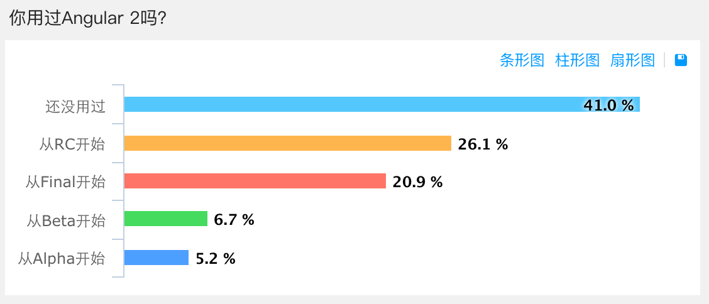
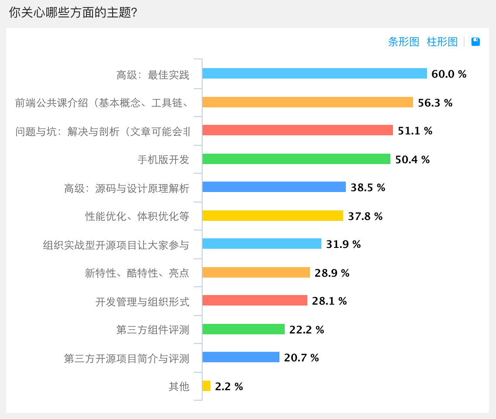
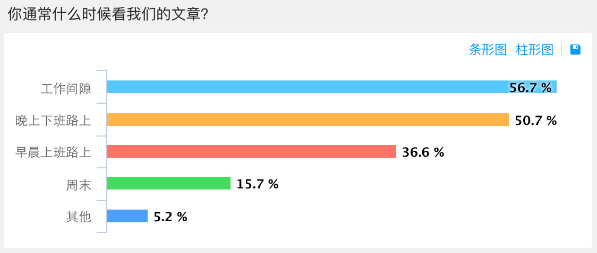
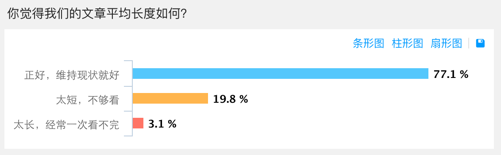
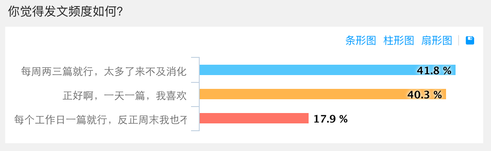
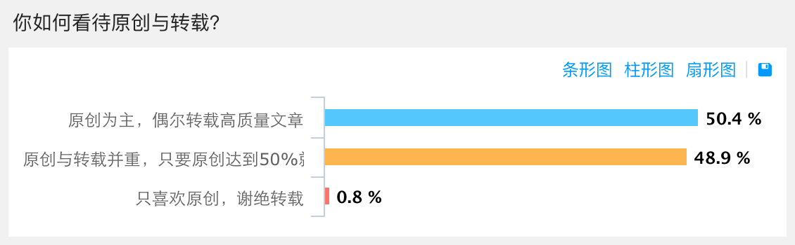
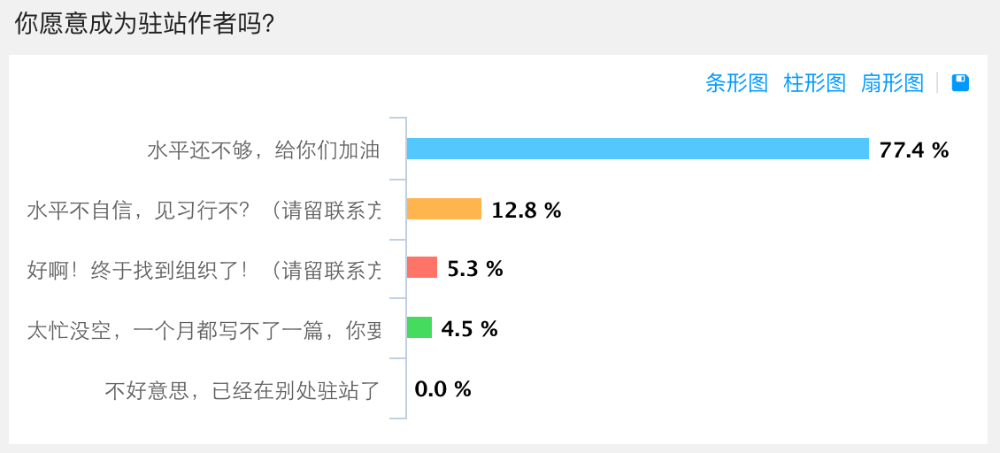
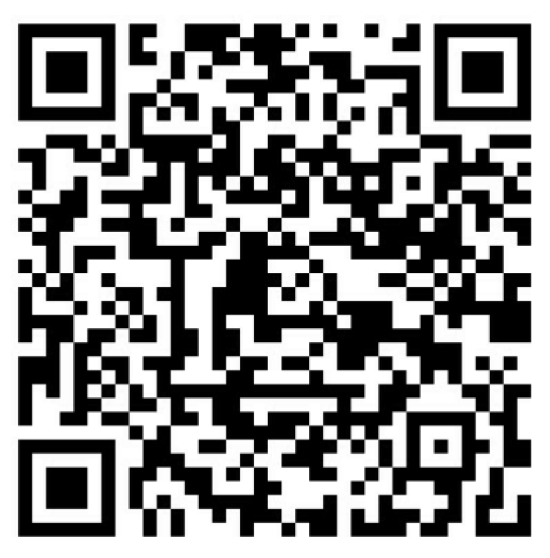

# 调查结果与后续计划

在国庆前发起的“Angular中文社区公众号未来的方向”调查中，我们共收到了135份反馈。老实说，这个结果远超我的预期，非常感谢大家的热情参与。

这里，我将和大家分享一下统计结果，并据此制定后续发布计划。当然，本计划仍然会不断收集你们的反馈，今后无论是在工作计划上还是在内容安排上有什么意见或建议，都欢迎随时给我们留言。

## 你用过Angular 2吗？

可以看出，有41%的用户是从未使用过Angular 2的，因此从整体上来说，我们的文章也将遵循40%基础+60%中高级的比例，并随着时间的推移逐步提高中高级内容的占比。

## 你关心哪些方面的主题？

在主题选择方面，也和上一个问题中的用户基础水平大致对应，不过难度上的两极分化比较明显。由于前一阵儿基本上是我和一位同事在推送，因此这些文章在难度和主题选择上相对比较单一，我们会进一步提高作者的多样性，并且欢迎各位随时给我留言加入到作者队伍中来。

除此之外，我们还会进一步完善Angular-BBS程序，让大家更容易投稿。前一阵儿我的工作重点是写文章，而接下来，我的工作重点会放在完善BBS程序上，并将其和微信整合得更加紧密，以便更好的协调多位作者的工作。

## 你通常什么时候看我们的文章？

正如当初所预期的，我们的读者大多数利用的是上下班和工作间隙的碎片化时间。能有这么多积极上进的读者是我们的骄傲！但，这也让我压力山大啊，希望尽快拉来更多的人分担这份压力。

## 你觉得我们的文章长度如何？

这大概是最让我惊讶的一项结果了！我曾经以为会有至少一半儿的人抱怨文章太长，因为这就是我自己阅读时最强烈的感觉，不过看来我还是太低估大家的热情了。

## 你觉得发文频度如何？

这项和预期的结果差不多。在目前的团队配置下，每天一篇确实很难保证质量（感谢一位读者对“路由”那篇给出的尖锐反馈）。所以我们把接下来的基础目标定为每个工作日一篇，周末会休息或写一些杂谈 —— 比如“颈椎病防治指南”（手动滑稽）。等到创作小组和论坛正常运转起来，再根据情况恢复每天一篇的最低发文频度。

## 你如何看待文章与官方文档的重叠？

这是我当初最为纠结的一个问题。因为官方文档包罗万象，几乎涵盖了Angular 2中的方方面面，因此几乎任何文章都会与官方文档存在大量重叠内容（包括现在已经发表的这些）。作为原创，不可能永远有创新点，更多的时候是在以另一种方式来组织和表述。

不过从反馈来看，我还是多虑了。接下来，我们仍然会尽量发表一些有技术创新点的文章，不过更多的会以普及型文章为主，比如为不同背景的程序员讲解某些Angular 2概念，以及对官方文档中某些重要文档的导读或补充。

## 你如何看待原创与转载？

从这里可以看出，大家对转载的态度还是比较开放的。

当然，对于转载的质量，我们必须严格把关。毫无疑问，我们所有的转载都会提前征求到授权才会转载，目前主要的合作来源是公众号“谷歌开发者”和“ThoughtWorks洞见”，这都是我们最亲密的友军。其它文章的选择我们会以前端相关、开发相关的精品技术文章为主。

在数量上，我们会把转载控制在30%以下，在目前的发布频率下也就是每周最多一到两篇。

## 你怎么看我们选的微信题图？

作为一个大处女座，这曾是我最头疼的问题。

不过好在大家都给了我充分的谅解。还有一些朋友提出了一些很好的建议，比如每天换图，但是不一定要跟主题相关，放些风景、萌物、花儿等都可以。

因此，我后面会优先贴近主题选图，如果找不到，那就改用风景以及“安哥拉兔”等等。当然，这些都会选择自由版权的。如果有一天你看到我又用了Angular的红色徽章作为题图……好吧，那确实表示我找不到图了。

如果你有跟Angular比较契合的免费图库资源，请给我留言，万分感谢！

## 你愿意成为驻站作者吗？

有超过1/5的人愿意驻站！稍等，先让我感动一会儿……

这个结果有点出乎意料，不过，我真是太高兴了，头发终于保住了，你们是不知道我当初为了写稿子熬成啥样，再这样持续两个月我都要成地中海了。

不过，选了这几个选项的好多人都没有留下自己的联系方式…… 光精神支持可不行啊，来，快到碗里来：

请选择了中间这三个选项的朋友们识别这个二维码加入我们的写作群，不想参与写作的就别进来啦，这群不回答技术问题，还会被催稿哦（手动奸笑）。
另外我也会给留了邮箱的这几十位朋友邮件发送这个二维码。

该二维码只在六天内有效，请收到邮件的朋友们及时加入。

## 永不停息！

“把优秀的技术推荐给优秀的人”。这是责任，也是承诺。借助这个公众号平台，以及Angular BBS（点击“阅读原文”进入的就是），愿我们能助你展翅高飞、实现梦想。更希望各位能借助这个平台，帮助彼此，携手前进。无论是打工还是创业，一个繁荣的社区，都将是我们共同的资源。
