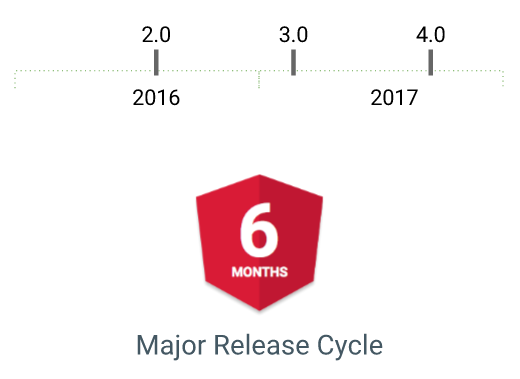
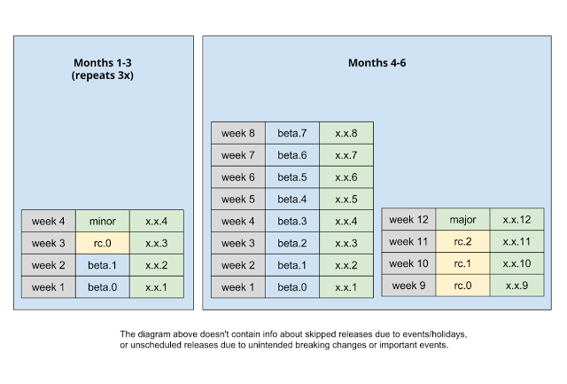

# 流言终结者！Angular未来的版本发布计划，官方的博客以及我的解读

## Versioning and Releasing Angular

## Angular的版本与发布

> 原文来自：<http://angularjs.blogspot.hk/2016/10/versioning-and-releasing-angular.html> 原作者为Igor Minar。由于微信的限制本文中内嵌的链接（绿色）会被自动移除，建议点击“阅读原文”链接查看。

In order for the ecosystem around Angular to thrive, developers need stability from the Angular framework so that reusable components and libraries, tutorials, tools and learned practices don’t go obsolete unexpectedly.

为了让围绕Angular所建立的生态系统茁壮成长，开发者需要Angular框架足够稳定，以便让那些可复用的组件和库、教程、工具和学到的实践不会突然被废弃。

However, we also all want Angular to keep evolving. To achieve both goals, we’re implementing semantic versioning and new development processes to help ensure that future changes are always introduced in a predictable way. We want everyone who depends on Angular to know when and how new features are added, and to be well-prepared when obsolete ones removed.

然而，同时我们也都希望Angular能继续演化。要同时达成这两个目标，我们就得引入语义化版本规范以及新的开发流程，以确保将来总能以可预见的方式引入变更。我们希望依赖于Angular的每个人都知道：我们将在何时添加新特性以及如何添加，而当某个废弃的特性将被移除时，你们也能有足够的时间提前做好准备。

Starting with the 2.0.0 release of Angular, we’ve adopted the following development processes:

从Angular的2.0.0发布时开始，我们采用了下列开发流程：

- We use [semantic versioning](http://semver.org/) for signaling the content of Angular releases.
- 我们使用[语义化版本号](http://semver.org/)来标记每次Angular所发布的内容。
- We have moved to time-based release cycles so that you can plan ahead.
- 我们改用基于时间的发布周期进行发布，以便你能提前制定计划。
- We have a deprecation policy so that you know how to get notified of API changes ahead of time.
- 我们制定了废弃策略（deprecation policy），以便你能提前注意到API的变更。
- We have clarified the distinction between stable and experimental APIs.
- 我们清晰地区分出了稳定的API和试验性的API。
- We have clarified the scope of our Public API surface.
- 我们澄清了公开API的范围。

### Semantic Versioning
### 语义化版本

SemVer means that our version numbers are meaningful. Patch releases will not change the functionality, minor releases will contain only additive changes, and breaking changes are reserved for major releases.

语义化版本（SemVer `major.minor.patch`）意味着我们的版本号是有意义的。补丁（patch）不会改变任何功能，次（minor）版本只包含增量修改，而破坏性变更则留给主（major）版本。

### Time-based Release Cycles

### 基于时间的发布周期

In addition to using meaningful numbers for our releases, we’ve built a schedule of releases so you can plan and coordinate with the continuing evolution of Angular.

为了让这些发布能使用更有意义的数字，我们制定了一个发布计划，以便你能有所计划，并能一直和Angular同步成长。

In general you can expect a patch release each week, about 3 minor updates and one major update every 6 months. We’re also baking quality into our schedule by providing Betas and RCs for each major and minor release.

一般来说，你可以期待每周都发布一个新的补丁，每六个月有三个次版本号和一个主版本号更新。我们还会为每个主版本和次版本的发布提供若干个Beta和RC，以便标记出它们当前的完成质量。

We’ve been following this new schedule since our 2.0 announcement and plan to release a new minor release – Angular 2.1 – next week.

自从2.0发布以来，我们一直在遵循着这样的新计划，并且准备在下周发布下一个次版本 —— Angular 2.1。

Time-based releases give eager developers access to new beta features as soon as they are ready, while maintaining the stability and reliability of the platform for production users.

基于时间的发布能让一些有准备的早期开发者访问到最新的beta版功能，与此同时，我们还会为产品环境下的用户维护一个稳定、可靠的平台。

### Deprecation Policy

### 废弃策略（deprecation policy）

Breaking changes are disruptive, but can be necessary in order to innovate, keep pace with changing best practices, dependencies or changes in the (web) platform itself. To make these transitions more predictable, we’re both implementing a deprecation policy, and working hard to minimize the the number of breaking changes in Angular.

谁也不想要破坏性变更，但是对创新而言，这是不可避免的，这样才能让我们赶上最佳实践、依赖库甚至Web平台本身的变革。为了让这些变化更具可预测性，我们同时做了两方面的努力：在践行“废弃策略”的同时，努力减少Angular中出现的破坏性变更数量。

We’re taking the following steps to ensure that developers have plenty of time and a clear path to update:

我们通过下列步骤来确保开发者有充裕的时间和清晰的路径来实现更新：

- When we announce a deprecation via our release notes, we’ll also announce the recommended update path.
- 当我们通过“发布说明”宣布一项废弃特性时，也会同时宣布建议的修改路径。
- We’ll continue to support existing usage of a stable API (i.e. your code will keep working) during the deprecation period, and you’ll always have more than 6 months (two major releases) to update.
- 在废弃阶段，我们会继续支持对现有的稳定API的使用（也就是说你的现有代码仍然可以工作），因此你至少有六个月的缓冲期（跨两个主版本）进行这些修改。
- We’ll reserve any peer dependency updates with breaking changes for a major release. An example of this is that in our next major release, we’ll be updating our Typescript dependency to version 2.
- 我们将在主版本中坚持不改变任何平级（peer）依赖。比如在我们的下一个主版本中，才会把对TypeScript的依赖升级到它的第2版。

### Stable vs Experimental APIs

### 稳定版 vs. 试验性 API

If you browsed through our API docs, you probably noticed that we marked some of our APIs as experimental. We feel that experimental APIs are solid enough to be in production, but they require field-testing to validate that they work well for a variety of community use cases.

如果你浏览过我们的API文档，可能会注意到我们把某些API标记成了试验性的（experimental）。虽然我们觉得这些试验性API用在产品环境应该足够可靠了，但是仍然需要进行实地测试来验证它们是否在一大堆社区用例中也能很好地工作。

Experimental APIs will follow SemVer(no breaking changes outside major releases), but not our deprecation policy. If you use an experimental API, you should expect changes, some of which might not have a deprecation path. That being said, we try to minimize disruptions for our intrepid community developers and will document any API changes.

试验性API**同样会遵循语义化版本规范SemVer（除非主版本变化，否则不引入破坏性变更）**，但是不会遵循我们的废弃策略。如果你使用了试验性API，那么就要直面变化，甚至可能某些变化都不会有废弃后的修改路径。也就是说，我们会竭尽全力避免对勇敢的社区开发者造成的破坏，并且对任何API变更都进行文档化（译注：但对于试验性API来说，并不一定总能给出修改方案）。

While [part of our API surface is still experimental](https://angular.io/docs/ts/latest/api/#!?status=experimental), none of the core use cases require the use of experimental APIs. Examples of experimental APIs include debugging apis, web worker support, i18n, http and animations. As these APIs mature and get more exposure in the real world, will be moving them from the experimental to stable category.

此刻[我们的一部分API仍然处于试验期](https://angular.io/docs/ts/latest/api/#!?status=experimental)，没有任何核心用例必须使用这些试验性API。这些试验性API的例子包括：调试API、Web Worker支持、i18n、http和动画。当这些API足够成熟，并且在现实世界中用得更多时，就会把它们从试验性API修改为稳定版API。

### Public API Surface

### 公开API层

Angular is a collection of many packages, sub-projects and tools. In order to prevent accidental use of private APIs and for you to clearly understand what is covered by the guarantees described in this post, we have documented what is and is not considered [our public API surface](https://github.com/angular/angular/blob/master/docs/PUBLIC_API.md).

Angular是很多包、子项目和工具的集合。为了防止意外使用私有API，并帮你清晰的理解本帖子中所做的这些担保，我们写了一篇文档，以记载哪些API属于我们的[公开API](https://github.com/angular/angular/blob/master/docs/PUBLIC_API.md)。

## 我的解读

这是Angular开发组的核心开发人员对AngularConnect上所做演讲的进一步阐释。

可以看出，前些天在网上流传的只是一个没有给出任何详细解释的标题而已，而这些含义丰富的核心内容全都遗漏了。

Angular开发组的版本发布策略并非如传言所暗示的那样会让你现在所学的一切付诸东流，而是一种兼顾了稳定与演化的工程化策略。它既能让激进的开发者尽早尝试新的特性和API，又能让产品环境上的开发者长久稳定的使用现有版本，并且用半年的时间把被废弃的API替换掉。

事实上，这种版本发布策略并非Angular开发组的首创。无论是Java世界、.net世界还是NodeJS世界，这都已经几乎是高品质框架/库的标准实践。

这种明确的版本发布策略，带给我们的应该是信心而非恐慌。今后若有任何问题，请向我们留言求证，我们会直接向Angular开发组索取第一手的权威资料并转达给各位。我倡议对此类重大问题的任何一次传播，都应该是完整、全面的，不要断章取义，误导读者，也希望大家都能作理性、睿智的开发者。

## 工作预告

这应该是我最后一次就这个问题做出澄清了，也请大家帮忙转发，不要再让其他人受传言的困扰。

现在，我们已经组建了一支背景迥异的驻站作者团队，会继续为大家创作更多关于Angular 2的原创内容，预计本周内就会有来自小鲜肉的处女作登场。

如果你听说过在伦敦举行的AngularConnect，那么应该也知道上面干货满满，可惜因为语言障碍和墙的影响，我们无法顺畅的观看。我们已经跟官方开发组拿到了视频及字幕的原稿，接下来，我们会逐渐为它们加上中文字幕，并上传到国内网站上，供大家欣赏，谢谢！第一期：《移动App技术》正在紧张制作中，争取本周末之前和大家见面。

同时，我们的另一个团队正在开发Angular BBS，争取尽早开放自由提问功能，建设一个繁荣的Angular 2主题社区。

要想了解最新、最真实的第一手内容，请关注我们的微信公众号“Angular中文社区”：

谢谢大家！
