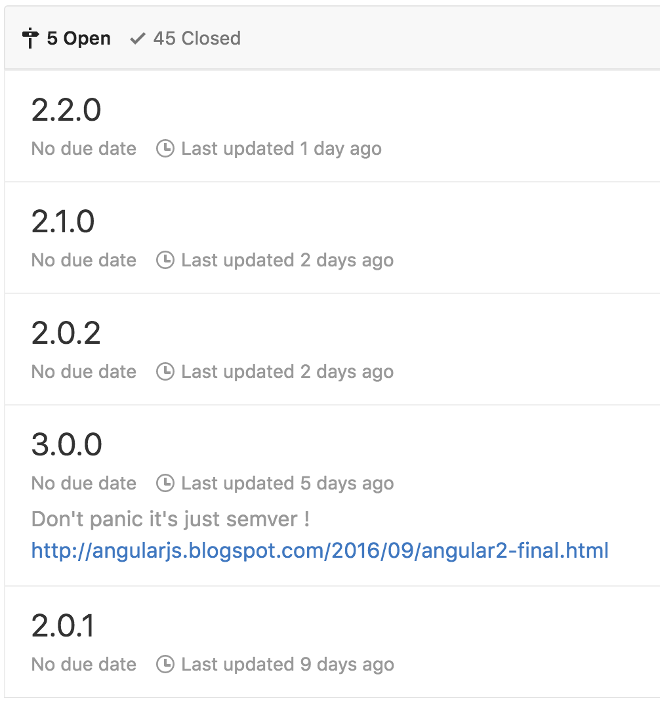

# 辟谣！Angular 3还早着呢！

最近几天不知道从哪里传来一股谣言，说是Angular将在半年后推出3.0版，并且会按照每半年发布一个主版本的频率迭代。为了防止读者被误导，特此辟谣！

## 起源

谣言的出发点是<https://github.com/angular/angular/milestones>中列出的里程碑，抓图如下：

注意3.0标签下的这句话：

>Don't panic it's just semver ! <http://angularjs.blogspot.com/2016/09/angular2-final.html>

如果是因为造谣者的英语水平太烂，那么尚可原谅，否则不知是何居心。我来翻译给大家听：

>不用头疼，这只是一个语义化版本号（semver）！参见官方的Angular 2最终版发布声明<http://angularjs.blogspot.com/2016/09/angular2-final.html>

那么，什么是语义化版本呢？

语义化版本，英文全称是Semantic Versioning，也就是说，让每个版本号都具有特定的意义和规范，以便在框架/库的作者和使用者之间形成一个明确的契约。而这个“语义”中最重要的一点就是兼容性。

## 官方的承诺

在Angular 2的发布声明中有一段儿话，我给大家对照翻译一下：

> To make it easy to manage dependencies on stable Angular releases, starting today with Angular 2.0.0, we will move to semantic versioning.  Angular versioning will then follow the MAJOR.MINOR.PATCH scheme as described by semver:
>
> 为了在稳定版的Angular发布之后能够更轻松的管理依赖，从今天这个Angular 2.0.0开始，我们将严格遵循语义化版本规范（semver）。
今后，Angular的版本号将遵循由semver规范所描述的MAJOR.MINOR.PATCH方案：

> - the MAJOR version gets incremented when incompatible API changes are made to stable APIs,
> - 当对已经标记为稳定（stable）的API进行不兼容的修改时，增加主版本号MAJOR，
> - the MINOR version gets incremented when backwards-compatible functionality are added,
> - 当添加了向后兼容的功能时，增加次版本号MINOR，
> - the PATCH version gets incremented when backwards-compatible bug are fixed.
> - 当以向后兼容的方式修改了bug时，增加补丁号PATCH

> Moving Angular to semantic versioning ensures rapid access to the newest features for our component and tooling ecosystem, while preserving a consistent and reliable development environment for production applications that depend on stability between major releases, but still benefit from bug fixes and new APIs. 
>
> 迁移到语义化版本方案可以确保我们的组件和工具等生态圈能快速用到最新特性。虽然即使保持了一致而可靠的开发环境，产品级应用仍然会依赖于主版本之间的稳定性，但这对BUG修复和发布新API来说仍然是显著的优点。    

这意味着官方已经给出了郑重的承诺：我们会在今后的发布中严格遵循语义化版本规范，不会轻易做出不兼容的修改。

怎样才能证明官方会兑现自己的承诺呢？很简单，回来看看Angular 1。从Angular 1.2开始，官方就已经在严格遵循semver了，所以你会看到基于Angular 1.2稳定版开发的程序，可以毫无障碍的直接升级到最新的Angular 1.5稳定版。这就是最直接的强力证明了。

这种承诺看似简单，其实需要以开发组很强的工程能力作为支撑。Angular源码本身包含了大量的单元测试和端到端测试，任何不兼容的修改都会破坏这些测试之一，这就是技术上的保障。那么，项目管理上呢？我们来看另一个问题：

## 为什么里程碑中会出现这么多版本？

如果有在github上进行框架或库的项目管理经验，那么对这些里程碑的设置是一目了然的。

补丁号比如2.0.1和2.0.2非常明显是用来改bug的，不会带来任何不兼容更改。

而次版本号2.1.0和2.2.0，则是用来引入新特性的，通常每个次版本号都不会一次性引入大量新特性，以免步子迈得太大，影响发布周期。因此当特性很多时，就会同时开启多个次版本号，并行开发，不过最终的发布还是有先后顺序的。

但主版本号就比较特殊了，它不一定会在可预见的时间内发布。假设你是Angular开发组的PM，当出现了一个可能会需要带来不兼容修改的需求时，你会怎么做？显然你不能把它放在补丁号或次版本号的里程碑中，否则会打破semver，那么就只能先放进下一个主版本号的里程碑，但是随着时间的推移，也许开发组中的某个聪明人灵光乍现，发现了一种可以完美向后兼容的方式，它就又移回次版本号了。只有当主版本号里程碑中积累了几十个无法向后兼容的问题时，才有可能开始针对下一个主版本号的开发。

这是一种进行项目管理的常用技巧。

## 真出了3.0会怎样？

我已经在官方开发组的内部频道中问过，迄今为止，官方还没有宣布过任何3.0的发布计划，更不用说4.0、5.0了。

但是，就算真出了3.0，其实也没什么可以担心的，因为这种不兼容的修改只会针对极少数API。像Angular 2这种经过了两年半的开发，迭代过56+18+8个版本的巨型开源库，当正式发布之后，其API的稳定性可以信赖，大范围更改API是不可想象的。

所以，即使将来真的出了3.0、4.0，应该也只是小范围的API变更而已，你只要对涉及到这些API的那部分源码稍作修改就可以了。从Angular 1到Angular 2属于技术的全面换代，而如果半年后的Angular 3还能再来这么一次全面换代，那就只能有一个原因：Angular开发组的技术实力已经甩了其它前端框架几条街。

## 事件感想：小聪明与大智慧

古人云：大智若愚。Angular开发组是一个埋头做技术的极客组织，大多数人都有着Googler共同的纯真情怀，不了解世间的险恶。值得钦佩。

但我不同。我认为君子应该左手持书右手持剑，既要对世间保持充分的善意和耐心，又要和错误的行为进行坚决斗争。要让世人明白，靠造谣这样的小聪明是不足以成事的。所以，除非造谣者能真心辟谣、道歉和悔过，否则我一个都不原谅！

## 工作预告

前端框架大战，最终的成就还是得看实力。这应该是我最后一次就这个问题辟谣了，也请大家帮忙转发，不要再让其他人受谣言的蒙蔽。

接下来，我已经组建了一个背景迥异的驻站作者团队，会继续为大家创作更多关于Angular 2的原创内容。同时，如果你听说过在伦敦举行的AngularConnect，那么应该知道上面干货满满，可惜因为语言障碍和墙的影响，我们无法顺畅的观看。我们已经跟官方开发组拿到了视频及字幕的原稿，接下来，我们会逐渐为它们加上中文字幕，并上传到微信中，供大家欣赏，谢谢！第一期：《移动App技术》正在紧张制作中，争取本周末之前和大家见面。

同时，我们的另一个团队正在开发Angular BBS，争取尽早开放自由提问功能，建设一个繁荣的Angular 2主题社区。

要想了解最新、最真的第一手内容，欢迎关注我们的微信公众号“Angular中文社区”：

感谢大家的关注！
