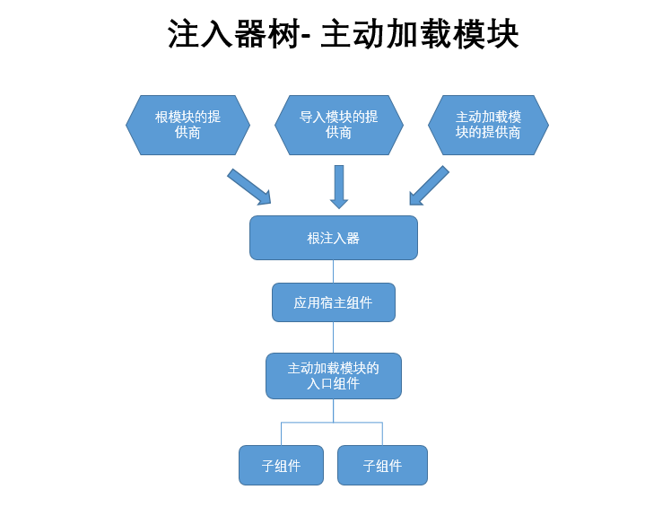
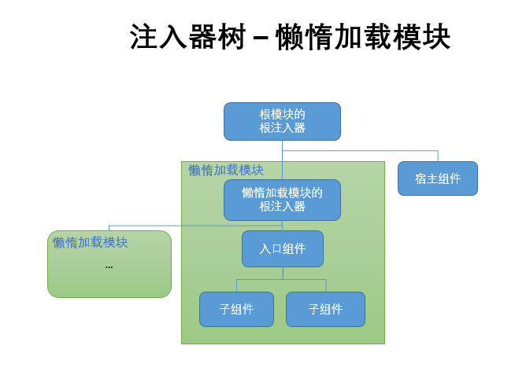

# Angular依赖注入机制与服务的作用范围

本文针对的读者群体是已经对Angular的多级依赖注入系统、模块和路由有一定了解的开发者们。如果还不了解这些，请先查阅下列官方文档：

1. [依赖注入](https://angular.cn/docs/ts/latest/guide/dependency-injection.html)
1. [多级依赖注入](https://angular.cn/docs/ts/latest/guide/hierarchical-dependency-injection.html)
1. [Angular模块（NgModule）](https://angular.cn/docs/ts/latest/guide/ngmodule.html)
1. [路由与导航](https://angular.cn/docs/ts/latest/guide/router.html)
1. [Angular模块常见问题](https://angular.cn/docs/ts/latest/cookbook/ngmodule-faq.html)

依赖注入系统是Angular最重要的特征之一。它是一种即时创建并提供服务的机制。理解该机制是深入理解Angular的重要一步。

Angular为每个模块、组件和指令都准备了一份注入器，这些注入器上下关联，形成一个树形结构。一般来讲，全应用级的根注入器处于树尖，下面是组件注入器和惰性加载模块的根注入器。

那么服务跟注入器有什么关系？你可以把注入器看作服务的容器。只有在将服务的令牌（通常为服务的类名）添加到元数据的服务提供商(providers)数组中以后，注入器才能创建和注入它们。可以在模块、组件和指令的元数据中添加服务提供商数组。

## 依赖注入机制

### 特征
Angular依赖注入系统有下面几个特征：

1. **单例**：

    所谓单例，针对的是注入器，而非服务的类本身。它不是说一个服务类只能实例化一次，而是指它在任何一级注入器所创建的服务实例是唯一的。所谓唯一，是指无论在它作用范围内的任何角落，将该服务注入进来，所得到的都是同一个实例，同一个对象，拥有同样的属性和值。
    
    假设一个组件更改了一个服务实例上某属性的值，那么，在其它组件中注入同一服务时，所得到的将是同一个属性已经变化了的实例，这正是为什么我们可以使用服务在组件中共享数据的原因。

    服务类可以在多级注入器被多次创建，从而产生多个实例。每个实例在自己的作用域内都是单例的。    

1. **作用域由上至下**：

    在任何一级注入器所创建的服务实例，它的作用范围辐射并局限于自己以及所有子级。注意，该实例的上级或者兄弟对其无访问权。

1. **服务查询由下至上**：

    当一个组件、指令、服务和管道等在其类构造函数中请求一个服务时，Angular从当前类所在的注入器开始寻找。如果没有找到合适的服务提供商，那么Angular就会向上一级注入器查询，以此类推，直到找到第一个拥有合适提供商的注入器，然后：（1）如果本级注入器还没有该服务的实例，Angular就会创建一个实例并完成注入。（2）如果本级注入器已经存有该服务的实例，则直接使用现有实例进行注入。

    如果一路查询到应用的根注入器都没有找到合适的提供商，那么Angular就会报错。

    **值得注意的是，当Angular由下至上找到第一个合适的服务后，它将立刻停止查找，忽略上面所有注入器。** 这样确保了每个依赖请求都有一个可以预见的服务。

## 模块

Angular模块是带有@NgModule装饰器函数的类，用来管理整个Angular应用的所有组件、指令、管道和服务等。几乎所有Angular自带程序库、外部程序库都是以模块的形式封装的。
详情参见[Angular模块（NgModule）](https://angular.cn/docs/ts/latest/guide/ngmodule.html)和[Angular模块常见问题](https://angular.cn/docs/ts/latest/cookbook/ngmodule-faq.html)。

每个Angular应用都有一个根模块，它是用来配置所有应用级别范围服务的最佳地点。

模块分为两种：主动加载模块和惰性加载模块。

1. 主动加载模块是在Angular启动时，会被自动加载的模块，通常包括Angular应用启动后的默认视图和少数需要的支持模块。

1. 惰性加载模块在Angular启动时不会被立刻加载，而是在用户通过路由器第一次访问该模块时才被加载。除了少数主动加载模块外，所有其它模块都应该设计为惰性加载模块。 

Angular对主动加载模块和惰性加载模块中服务提供商的处理方法**截然不同**。

### 模块分级规则

1. 根模块的注入器为应用根注入器，所有其它注入器都是它的子级。**应用根注入器中服务的作用范围贯穿整个应用**。

1. 主动加载模块的提供商会被自动升级到应用根注入器中。

1. 惰性加载模块拥有独立的根注入器，它的上级是宿主模块的根注入器，下级为本模块内其它注入器。


### 主动加载模块

主动加载模块的服务提供商被Angular升级到应用根注入器中，作用范围贯穿整个应用。这样设计的主要原因是为了让我们能够通过模块扩展应用。见下图所示：




重点有以下几点:

1. 主动加载模块的提供商被提升到应用根注入器中。**建议不要在除了Core Module之外的主动加载模块中注册任何提供商**

1. 主动加载的模块是应用宿主组件（比如AppComponent）的子级，它们可以注入应用宿主组件的提供商。

1. 在根模块或者主动加载模块中，导入模块所提供的服务将被注册到根注入器中，具有应用全局作用范围。这里**导入模块**是指在@NgModule装饰器中的`imports`数组中的模块，不是文件级别ES6的`import`语句。

最佳实践为：

1. 为所有全局服务提供商创建一个名为Core Module主动加载模块
    * 将根模块的提供商移到Core Module里
    * 不要在除了Core Module之外的任何主动加载模块中注册任何提供商
    * 在Core Module里导入公用模块库，比如表单库、路由库等
1. **只**在根模块中导入Core Module    

### 惰性加载模块



重点在于：

1. 惰性加载模块拥有自己独立的注入器，服务的作用范围贯穿整个模块
1. 惰性加载模块中导入模块（@NgModule装饰器的`imports`中导入）的服务将被注册到该惰性加载模块的根注入器，作用范围贯穿整个模块
1. 惰性加载模块的根注入器被提升为宿主模块根注入器的直属子级，而不会像主动加载模块那样被升级到应用的根注入器
1. 虽然惰性加载模块一般会被路由器加载到带有`<router-outlet>`的宿主/入口组件中，但是惰性加载模块的根注入器不是宿主组件或入口组件注入器的子级，所以无法注入它们的服务提供商        
    
提供服务的最佳实践是使用模块来配置服务提供商，除非想要将服务提供商的作用域控制在组件树内。

## 组件级服务范围

如果想要将服务提供商的作用范围控制在组件以及它的子级之内，则在组件内提供服务，将服务提供商添加到组件元数据的providers数组中即可。

### 组件分级规则

1. 入口组件的包容规则： 
  
  入口组件是指那些只通过路由访问的组件，它们一般带有`<router-outlet>`路由插座。
  
  其他组件一般被路由器放置到入口组件的路由插座的隔壁，请注意，路由器**不会**将组件插入到`<router-outlet>`标签的内部。

  * 路由器将主动加载模块的组件插入到带有`<router-outlet>`的宿主组件时，入口组件是被插入组件的父级。

  * 路由器将惰性加载模块的组件插入到带有`<router-outlet>`的宿主组件时，入口组件**不是**被插入组件的父级。被插入组件的父级为懒惰加载模块的根注入器。  参见[上面](#惰性加载模块)的解释。

1. 其他组件的分级规则 - 包容规则：宿主组件是视图子级(ViewChildren)和内容子级(ContentChildren)的上级。

  * 视图子级是在宿主组件模板中使用的组件和指令。
  * 内容子级是宿主组件选择器中间包含的内容，比如
  
      ```
      <parent-component>
          <content-children></content-children>    
      </parent-component>
      ```
