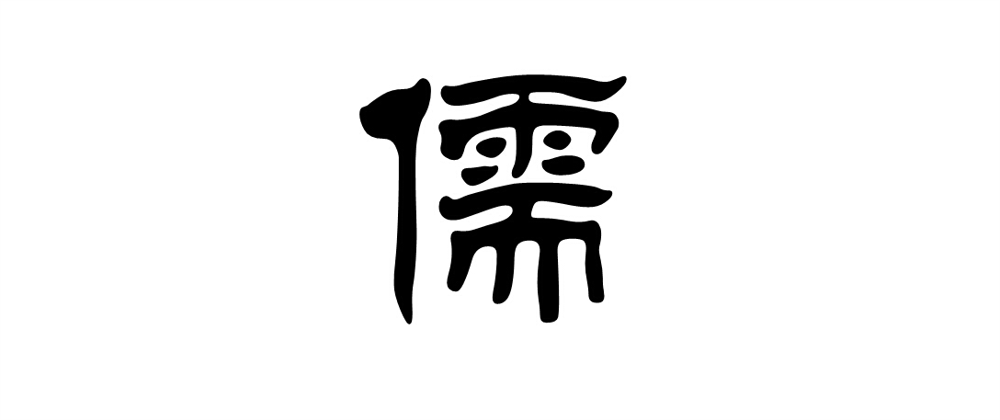

# 周末杂谈：君子不器

很多程序员会对自己的未来感到困惑，在我十八年的职业生涯中自然也曾想过不止一次。今天的周末杂谈，就和大家谈谈我对这个问题的思考。

雪狼言必称孔孟，那么我们就先从《论语》中的一句话开始。

> 子曰：君子不器 —— 《论语 - 为政》

这句话如果直译，那么意思就是“君子不是东西”，呃，好像有点骂人的味道，那就 …… “君子是东西”？咋还是骂人咧！

好吧，换回严肃脸。

这句话的关键在于这个“器”字。这也是文史界争议比较多的地方。这里我只说一些比较主流的说法。
