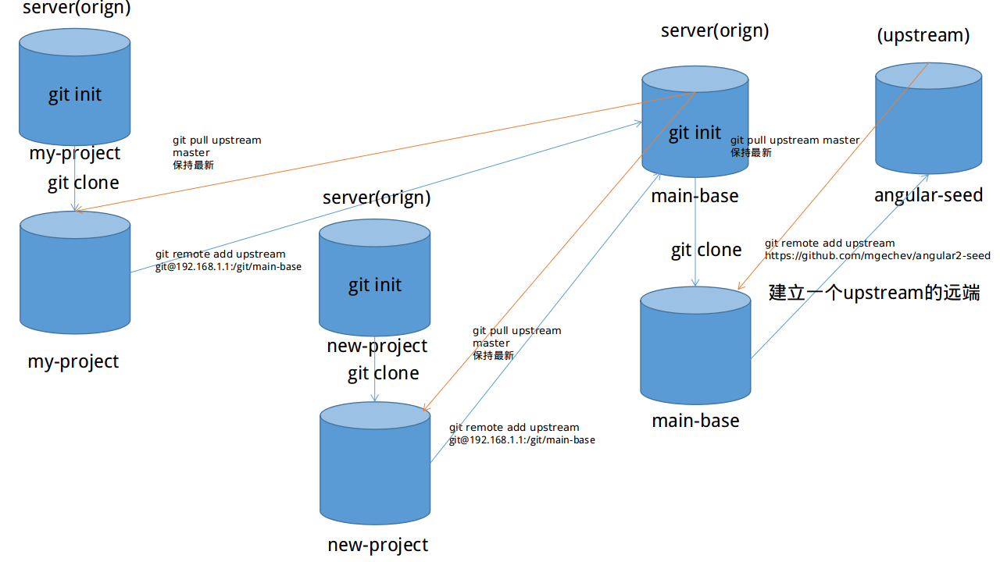

# 如何工程化开发大型angular2项目（上篇）

## 前请提要：
  目前前端项目越来越复杂，管理一个前端项目需要考虑的方面越来越多，例如工具选择、项目构建、代码自动review工具、代码打包上线、开发生产环境分离、项目结构管理以及第三库引入管理等等之类问题。所以下面是我开发angular2项目时遇到的一些问题以及自己的一些解决方案以及项目管理的思路。这些内容将会以一个系列展开。
## 项目构建篇：
   angular2官方提供ng cli构建工具，但是投入使用后发现并不是符合我们需求。因为我们之前项目是基于gulp整套工作流，所以一直在寻找与gulp相结合的ng2案例。后来找到一个angular-seed项目，于是我将该项目设立为种子项目，依据该种子项目我们开发了7、8个angular2项目。下面简单介绍一下如何利用种子库创建衍生库，只要种子库保持更新，其他库可以同步保持更新.

### 建立种子库：


上面的图画得比较烂，我还是来好好解释一下。首先我们得有一个主心库，这个库十分重要，里面没有业务逻辑的代码，主要是平时开发时所需要的所有脚本，以及npm的一些基本依赖。另外一些共用组件，共用逻辑代码（例如登录验证等等）。主心库创
立完后，我们需要建立一个upstream的远端指向angular-seed项目
```
  git remote add upstream https://github.com/mgechev/angular-seed.git 
  git fetch upstream
  git merge upstream/master
```
平时我们想要更新主仓库时，只要git pull一下upstram远端，就可以保持最新了。如果不想人工手动去更新的化可以交给jenkins定时去更新，这样主心仓库永远是最新的了。
### 创建衍生库：
因为我们所有项目围绕主心库而衍生出来的，所以衍生库和主心库的关心和angular-seed关系一致。我们指定我们衍生库的远端upstream为我们的主心库，这样只要主心库是最新的，这样所有衍生库都可以保持同步更新。可以享受主心库提供的共用配置和
业务逻辑。看上去过程比较繁琐，其实只需要将整个操作过程的指令集合到bash脚本中，执行脚本是指定参数名为你的项目名称。这样快速就可以构建一个angular2项目，所以整套流程适合有复杂业务的项目。
```
  git remote add upstream git@192.168.1.1:/git/main-base 
  git fetch upstream
  git merge upstream/master
```

## 项目开发篇：
   既然我们构建完项目后，那么马上开工吧。随着前端项目越来越复杂，里面配置文件越来越多。因为开发环境和生产环境需要调用服务端接口地址又是不一样的，像我开发微信项目的，开发环境用测试的appid和生产环境的appid也是不一样的。情况更严重的是我们每个客户都有自己独立的配置信息（所以开始考虑多租户模式，不然下去是大坑）。理想情况下：

```
  gulp build.dev --color --env-config dev
```
  执行上述命令，就是启动开发dev环境的配置。利用yargs这个node工具去接收我们传递过去的参数，以此来区分开是开发模式下还是prod模式下。下面贴一段代码举例一下：

```
  import { argv } from 'yargs';
  ...
  export function templateLocals() {
  // 这里就是我们通过env-config变量获取参数
  const configEnvName = argv['env-config'] || argv['config-env'] || 'dev';
  const configPath = Config.getPluginConfig('environment-config');
  const baseConfig = getConfig(configPath, 'base');
  // 依据dev和prod以及对应的路径获取对应的配置文件
  const config = getConfig(configPath, configEnvName);

  if (!config) {
  throw new Error('Invalid configuration name');
  }

  return Object.assign(Config, {
    ENV_CONFIG: JSON.stringify(Object.assign(baseConfig, config))
  });
 }
    // 具体代码可以克隆angular-seed去查看
```
  另外angular2提供[enableProdMode](https://angular.io/docs/ts/latest/api/core/index/enableProdMode-function.html)接口能够优化打包出来的代码，但是我们开发时是不需要用到该接口如何去分离开来呢？gulp有个好插件，完美解决该问题，[gulp-template](https://www.npmjs.com/package/gulp-template)。我们只要在我们
    代码中加入类似<%= BUILD_TYPE %>，这样就可以赋值给BUILD_TYPE，我们可以合理得去控制。
```
  import { enableProdMode } from '@angular/core';
  ...
  if (String('<%= BUILD_TYPE %>') === 'prod') { enableProdMode(); }
```
  关于开发配置十分细碎，所以不做详述，可以日后咨询。

## 下篇预告：
下篇会涉及项目目录结构管理，以及angular2在移动端开发的经验，项目打包上线的经验
ps： 感兴趣的朋友加我QQ： 846432362
