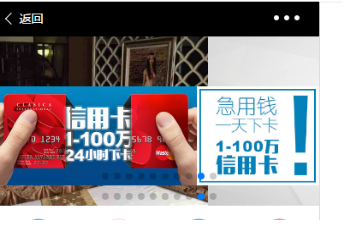

# 如何工程化开发大型angular2项目（上篇续）
## 项目目录管理
说到一个大的项目，随着项目越做越大。会发现目录越来越多，层级越来越深。万一哪天临时来的新同事梳理目录，够他喝一壶的了。不仅梳理困难，而且平时debug，也是够呛
我在devtool里找我想要调试的脚本，简直是‘翻衣倒柜’。就这些花的功夫够写好几行代码了。

目录管理算不上啥技术活，但是管理不甚，真的会浪费大量时间效率，导致产能低下。凡是要花你超过3分钟的事情，一定要留个心眼。要不为什么说日本一些大型工程做得好，主要他们流程细节讲究精确。

不扯这么多，其实每个团队都会有属于适合自己的一套规则规范，别人不一定适合你，你的不一定适合别人的。我简略说说我们在协同协作的一些约定吧。
在根目录无外乎：包依赖配置文件、代码缩进、css代码风格、ts代码风格等等一些配置文件，虽然有些零碎，但很大程度上自动得去维护我们项目一些基础规范。
当然包括代码规范的README.MD.下面简单罗列下：
```bash
├── dist  //打包输出目录
├── .editorconfig   //这个大家应该熟悉吧，具体可以访问 http://editorconfig.org
├── .gitignore
├── gulpfile.ts
├── .jshintrc
├── karma.conf.js
├── node_modules
├── package.json
├── protractor.conf.js
├── README.md
├── src   // 项目主入口
├── e2e
├── test
├── .stylelintrc
├── tools // 共用工具类，里面主要管理gulp不同任务脚本，以及依赖的一些第三方库管理，还包括自己写一些.d.ts声明文件
├── tsconfig.json
├── tslint.json
├── yarn.lock
├── 代码规范V2.MD

```
看完上面罗列的只是一级目录（ps：大家可以自己用tree -L 1等命令，查看自己的项目目录结构），其中一些大家都是可以通用的。
其实最核心还是我们主程序这一块，我们首先按照业务来划分譬如主页、登录、关于，进一步针对面向不同角色用户的划分会员、员工、管理。如果和角色关联性再进一步把业务抽象化划分：商品、门店等等抽象化概念。当然具体到某一功能时我们依据代码模式去
划分：例如数据模型、资源层、组件层等等。其实这些划分标准应该是自己团队同一讨论协商出来的，而且不是死的，阶段性去调整。当然大家要同一去执行，不然真的是如同虚设。

下面跟着我的逻辑来简单看看目录的划分：
```bash
└── client
    ├── app
    ├── assets
    ├── css
    ├── favicon.ico
    ├── index.html

```
这里划分很简单，前端客户端目录存放资源目录，样式管理目录，业务应用目录。就不做详述了。
```bash
├── app
│   ├── about
│   ├── app.component.e2e-spec.ts
│   ├── app.component.html
│   ├── app.component.spec.ts
│   ├── app.component.ts
│   ├── app.module.ts
│   ├── app.resolver.ts
│   ├── app.routes.ts
│   ├── home
│   ├── login
│   ├── main
│   ├── main-prod.ts
│   ├── main.ts
│   ├── rxjs-extensions.ts
│   ├── shared
│   ├── system-config.ts
│  

```
app.component作为组件树顶级，首当其冲放在应用根目录下。项目里默认在app.component放置路由插座，也包括一些共用的sidebar和toolbar或者tabbar。大概构成整个web app的骨架。main目录则是我们应用主入口。对于shared资源共享目录，特地把共用的组件、服务工厂、pipe全部封装到SharedModule里。
利用Angular模块的特性，我想用你把你这个模块import进来就行。不用额外去找我想要的组件或者服务工厂一一导入进来。当然SharedModule会面临一个越来越臃肿的问题，随着项目变大，我们可以把这个再进行下一拆分成多个小的Module，职能划分更加清楚。
对于单个功能如何如何去命名规范，其实Angular官方已经有很好的风格指南===》[传送门](https://www.angular.cn/docs/ts/latest/guide/style-guide.html)，对于单一功能主要有Module，Router，Component，Service，Model组成，一个大的功能也是由这些小的模块组成。其实module隔离性确实不错，有时担心某一模块的css会不会影响其他模块，其实不必担心。当然如果是*{}全局就另当别论了。
```bash
.
├── index.ts
├── pay.module.ts
├── pay-router.component.ts
├── pay.routes.ts
├── qrcode
│   ├── index.ts
│   ├── qrcode-show.component.html
│   ├── qrcode-show.component.scss
│   └── qrcode-show.component.ts
├── shared
│   ├── index.ts
│   ├── product.model.ts
│   └── wx-pay.service.ts
```
为了让其他功能引用多个该目录指定函数， 对象或者基础类型，为了代码看上去更加清爽,如下面
```typescript
import { a, b, c, d } from '../shared/index';
```
在每个目录定义一个index.ts,导出该目录下的函数， 对象或者基础类型
```typescript
export * from './a.model';
```
这其实就是所谓的封装桶[barrel](https://www.angular.cn/docs/ts/latest/guide/glossary.html),封装桶是把多个模块的导出结果汇总到单一的 ES2015 模块的一种方式。 封装桶本身是一个 ES2015 模块文件，它重新导出选中的导出，这些导入来自其它 ES2015 模块。
## Web安全
先上图：


对于运营商的劫持注入，大家应该都见过。这种方法最快的解决方案是把网站升级为https，还是http的朋友建议尽快升级为https，chrome对http默认视为不安全网站。
运营商的劫持，无非放放广告，插入一些莫名其妙的广告，恶心你的用户。把网站升级为https基本解决问题了。

但是最可怕的是那些掌握你网站脚本漏洞的黑客，往你网站插入恶意代码，你却浑然不知。尤其是那些涉及金融的网站如比特币交易网站或者支付金融相关的。最为著名的莫过于前段时间的“抢月饼”事件，其实算不上恶意代码注入，只不过是利用脚本做了自动化的事情。但在web安全上，轰动整个圈子。

防范跨站脚本(XSS)攻击
>XSS攻击
       XSS攻击类似于SQL注入攻击，攻击之前，我们先找到一个存在XSS漏洞的网站，XSS漏洞分为两种，一种是DOM Based XSS漏洞，另一种是Stored XSS漏洞。理论上，所有可输入的地方没有对输入数据进行处理的话，都会存在XSS漏洞，漏洞的危害取决于攻击代码的威力，攻击代码也不局限于script。
       -- [引用](http://blog.csdn.net/ghsau/article/details/17027893)


如果你想知道如何利用xss攻击，你可以看看这篇文章简单了解下[xss的原理分析与解剖](http://www.freebuf.com/articles/web/40520.html)。

其实xss攻击就是想方设法在你的dom里执行我想要的脚本，如下面的实现
```html
当找不到图片名为1的文件时，执行alert('xss')
<a href=javascrip:alert('xss')>s</a> 点击s时运行alert('xss')
<iframe src=javascript:alert('xss');height=0 width=0 /><iframe>利用iframe的scr来弹窗
</img>过滤了alert来执行弹窗
```
看完上面的你还觉得你的网站还是百分百的安全吗？凡是技术都有漏洞，但我们一定要想法设法去填补漏洞。
现在前端火热，把注意力放在web安全上估计很少，要不然哪有这么多闲扯的。
那么问题来了，有什么好的解决方案，让我马上去做一些基础的漏洞补救呢？
其实Angular2自带一个微型'杀毒器',他认为所有DOM都是不安全的，都是处于裸奔状态。如果你想在你的img里加一个不是同源的链接或者脚本，Angular2会告诉你：“同志，请麻烦你出示你的证件的原价和复印件。”
注入DomSanitizer服务，然后调用下面的方法之一，你就可以把一个值标记为可信任的。

* bypassSecurityTrustScript
* bypassSecurityTrustUrl
* bypassSecurityTrustResourceUrl

如果你不进行标记，会被强制标记为不安全不予显示。
Angular2温馨提示，尽可能少用原生的dom api，利用自带的模板机制，把一切处于掌控之中。

现在前端业务逻辑日益复杂，对于大型的Saas项目，一切细节都要考虑清楚。避免某一天收到一封邮件：
>我们在你的网站上发现xxx漏洞，请速往比特币账户：xxxxxxxxxxxxxxxxxxxxxx，打入3比特

[更多了解](https://www.angular.cn/docs/ts/latest/guide/security.html)

[往期文章：如何工程化开发大型angular2项目（上篇）](http://mp.weixin.qq.com/s/a00Kean4Lj3o7UAA1C7iGg)
