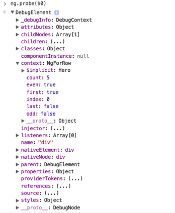

# Angular 2 中的 Structural Directive（结构型指令）

原文发布于：https://zhuanlan.zhihu.com/p/22404947

友情提示：

+ 这篇文章由于本身的内容取向，需要尽可能地保持严谨和全面，因此，可能对初学者并不十分友好。如果阅读本文的过程中觉得难度过大，可以考虑先把原文放入收藏夹中，过一段时间再来阅读；
+ 原文为双语版本，此处由于受众主要为中文用户所以仅摘录了中文部分，需要英文版本的读者可以进入上面的原文链接进行阅读。

Directive 一直是 Angular 中的一个重要组成部分，职能为扩展 HTML 语义。在 Angular 2 中，__Directive 被明确划分成三种类型：Component，Attribute Directive 以及 Structural Directive__（其中 Angular 1.x 也有这个划分，只是官方文档中没有明确提及）。其中，Structural Directive 虽然数量最少，却有着极高的重要性。

Angular 2 中，在 common 模块里内置了 3 个 Structural Directive：[NgIf](https://angular.io/docs/ts/latest/api/common/index/NgIf-directive.html)，[NgFor](https://angular.io/docs/ts/latest/api/common/index/NgFor-directive.html) 和 [NgSwitch](https://angular.io/docs/ts/latest/api/common/index/NgSwitch-directive.html)。和 Angular 1.x 有很大不同的是，__Angular 2 提供了通用的星号 DSL（类似于 *prop="something"）来实现自定义表达式语法__，而 Angular 1.x 只能自己靠正则匹配。其中，在 [Structural Directives](https://angular.io/docs/ts/latest/guide/structural-directives.html) 和 [Template Syntax](https://angular.io/docs/ts/latest/guide/template-syntax.html) 部分对这些 Directives 做了一些简单的介绍。但由于实在介绍的过于简单，既没有解释 DSL 的详细规则，也没有说明其运作原理。

本文中，将会解决这些，对 Structural Directive 的概念及原理进行介绍，同时剖析 NgFor 的实现方式以方便读者理解。


## DSL 语法规则

为了解释语法规则，我们首先从 DSL 的翻译过程入手。__星号 DSL 会被翻译两次__，其中的第一次非常特别极其简单，也就是：

```html
<element *prop="whatever here is">Content</element>

<!-- 变成 -->

<element template="prop whatever here is">Content</element>
```

接下来才是重要的部分，也就是第二次翻译，在第一次翻译后，才是 Angular 的解析器真正工作的开始（第一次翻译连正则都不用靠字符串拼接都能完成）。简单的说，__template 属性的值必须是一系列分号分隔的语句__，每个语句可以是： __1）赋值，2）冒号分隔的键值对__。类似于：

```html
<element template="key1: expression1; let var1 = expression2; key2: expression3; key3: expression4; let var2 = expression5;">
```

由于第一次翻译的缘故，第一个语句必然是键值对，也就是星号 DSL 的第一项内容必然是表达式，后面的语句可以自己任意排列。但是，稍微有点常识的人都能够看出，__我们天天在用的 NgFor 显然就不满足这个规则，那么为什么会是这个规则呢__？我们的 NgFor 第一次翻译后明明是：

```html
<element template="ngFor let hero of heroes trackBy trackByHeroes">
```

这里并没有那些分隔符号的痕迹，不是么？是，也不是。事实上，和很多现代语言一样，当你不主动提供分隔符时，__Angular 的模版解析器会自动尝试添加分隔符__，也就是帮你断句。此外，由于这个 DSL 几乎完全没有任何的二义性，因此添加或不添加（或部分添加部分不添加）分隔符几乎永远都能得到相同的结果。因此，上面的代码完全等价于：

```html
<element template="ngFor let hero; of: heroes; trackBy: trackByHeroes">
```

这样看着和我们上面的规则接近了很多，但还是有些不同，也就是：1）第一个 key（也就是 ngFor）并没有对应任何的 value，2）赋值部分没有赋任何值。实际上，这里仅仅是一丢丢的简简单单的语法糖的语法糖，也就是规则的附加规则，即：__1）如果后一语句是赋值，则当前的键值对可以只有键没有值，2）如果赋值只有变量声明部分没有赋值部分，相当于赋上 $implicit 这个变量的值__。另外，不知道是 Bug 还是 Feature，第一条额外规则所述的情况中键值对和赋值之间不能手动加分号，当然，对于从星号 DSL 翻译过来的情况，第一个键值对和第一个赋值（如果是赋值的话）之间本来就不会有分号。因此，上面的代码又可以继续等价为：

```html
<element template="ngFor let hero = $implicit; of: heroes; trackBy: trackByHeroes">
```

接着，现在开始就可以真的进行第二次翻译了。又一次简单的说，__1）对于键值对，第一个键值对的键会被当作基，添加到其后所有键值对的键之前，然后变成属性绑定（如果键值对没有值之后也就是一个没有值的属性）；2）对于赋值，会被翻译成一个 `let-` 开头的字面值属性绑定__。至此，我们就能够很清晰的理解第二次翻译的结果了，也就是：

```html
<template ngFor let-hero="$implicit" [ngForOf]="heroes" [ngForTrackBy]="trackByHeroes">
  <element></element>
</template>
```

友情提示，在 Angular 2 中，__有方括号（或 bind- 前缀）的属性和没有方括号（或 bind- 前缀）的属性都是属性绑定__。对于有方括号（或 bind- 前缀）的属性而言，例如 `[prop]="1 + 1"`，其数据绑定的内容是 `1 + 1` 的求值结果，也就是 2 这个数值（number）；而对于没有方括号（或 bind- 前缀）的属性而言，例如 `prop="1 + 1"`，其数据绑定的内容是 `1 + 1` 这个字面值本身，也就是 "1 + 1" 这个字符串（如果有插值的话绑定的是插值后的结果）。一些文章或视频中为了和事件绑定押韵而把属性绑定说成是有方括号（或 bind- 前缀）的属性是不严谨的。

最后补充一点，__`$implicit` 其实只是语义上的表现__，并不直接存在于翻译结果中，所以直接的翻译结果是：

```html
<template ngFor let-hero [ngForOf]="heroes" [ngForTrackBy]="trackByHeroes">
  <element></element>
</template>
```

综上，这就（应该）是星号 DSL 的规则了，因此我们现在也终于能理解 NgFor 的翻译过程了。

现在，如果我们愿意，我们可以用任何喜欢的方式来写 NgFor：

```html
<element *ngFor="let hero of heroes trackBy trackByHeroes"></element>
<element *ngFor="let hero trackBy trackByHeroes of heroes"></element>
<element *ngFor="let hero ;of heroes; trackBy trackByHeroes"></element>
<element *ngFor="let hero ;of: heroes; trackBy: trackByHeroes"></element>
<element *ngFor="let hero = $implicit; of: heroes; trackBy: trackByHeroes"></element>
```

## NgFor 的内部实现

从上一小节中我们知道，星号语法糖会被编译为普通的属性绑定。也就是说，__Structural Directive 在形式上并不会和 Attribute Directive 有任何不同__，只是它在内部所做的事情和 Attribute Directive 所做的事情的侧重点有些差异。

与其他 Directives 一样（对于 Entry Component 而言可能不是必须的），__NgFor 需要有一个 selector 来指定其应用的范围__。从上面的翻译结果我们知道，NgFor 需要作用在一个有 ngFor 属性和 ngForOf 属性的（template）元素上，因此对应的选择器就是 `[ngFor][ngForOf]`。在 CSS 中，属性选择器使用方括号的语法，并且多个选择器的组合仍然为选择器。于是我们得到 NgFor 的骨架：

```typescript
@Directive({
  selector: '[ngFor][ngForOf]'
})
class NgFor {
  // 类名叫什么并不重要
}
```

Angular 2 中，所有的 Directive（当然也包括 Component）都是 ES Class（当然实际上也可以用 Angular 2 的 ES5 API 来模拟 class 的方式），通过 Decorator 来实现额外的配置内容。

从上面我们已经知道，NgFor 会有两个 @Input() 属性（即属性绑定）：ngForOf 和 ngForTrackBy。这里我们会发现一个问题，NgFor 的选择器和其属性绑定并不对应，这是正常的情况。对于选择器而言，我们需要应用在一个所有场景里都能满足的选择器上，而 trackBy 是可选的部分，所以并不会出现在 Directive 的 selector 中，否则我们不写 trackBy 的时候它就不是 NgFor 了；对于属性绑定而言，我们只需要有值的属性，ngFor 属性虽然始终存在但是并没有任何内容，所以每次去拿到一个 undefined 也没有任何意义，而输入属性需要考虑所有的可选内容，比如这里的 trackBy。（实际上可能还有另外的属性绑定，但此处不作深入讨论）

所以现在我们可以增加属性绑定的声明：

```typescript
@Directive({
  selector: '[ngFor][ngForOf]'
})
class NgFor {
  @Input() ngForOf: any
  @Input() ngForTrackBy: TrackByFn
}

// interface TrackByFn { (index: number, item: any): any }
```

这里我们增加一个 ngForOf 属性，为 any 类型（其实这里本应该是 Iterable 类型，即实现了 Symbol.iterator 属性的对象）；另一个是 ngForTrackBy，是一个满足特定签名的函数类型（接收当前的 index 和集合中的当前 item 作为参数，返回任意值作为唯一性标识），这和我们在 Angular 1.x 中的用法稍有不同，我们无法继续使用内联表达式来作为标识，必须抽取成一个类方法。

有了参数，接下来我们就可以来进行操作了。这里我们需要做的事情很简单，__就是把 Template 变成一个 View，然后放进 ViewContainer 里__。

听上去可能有些陌生，Template 是什么呢？在 Component 中，我们会提供一个 template（或 templateUrl）属性，会自动进行 Template -> View 的转换，因为这里要做的操作非常简单，__一个 Component 有且只有一个 Template，并且也只会对应的一个 View__。而在 Structural Directive 中，就未必能有这么简单了，__比如这里我们需要根据循环项把同一个 Template 变成多个 View__。

我们知道 Angular 1.x 中有一个 $compile，其工作过程是：

```text
                       compile           + scope
template(raw/element) ---------> linkFn ---------> instance element
```

类似的，在 Angular 2 中，也有一个模版（Template）到视图（View）的过程：

```text
For component template:

               compile
template(raw) ---------> view factory -----------> view


For template tag template:

               compile                       + context
template(raw) ---------> template(compiled) -----------> view
```

看到这里，读者可能会有若干的疑问：

+ 为什么 Angular 2.0 中生成的结果是一个 View，这个抽象实体的存在目的是什么？
+ 为什么 Angular 2.0 中的 Template 在 Compile 之后还是 Template，那么 Template 到底指什么？
+ 为什么 Component 的 Template 就不需要 Context 就能实例化，而其他的 Template 就需要 Context 才能实例化呢？
+ Angular 2.0 中的 Context 和 Angular 1.x 中的 Scope 是什么关系？是不是像 Filter -> Pipe 那样的简单改名？

接下来，我们就会对这些问题一一解答。

众所周知，__Angular 2.0 的一个重大改进就是能够跨平台，因此，不再像 Angular 1.x 中一样使用基于 DOM 的模版，也不能像服务器端模版那样直接使用基于字符串的模版。为此，必须引入一个中间抽象（但并没有使用 Virtual-DOM）__。所以，Angular 2.0 中不再是直接生成 DOM 元素的实例，而是一个更为高层的抽象视图的实例，这里叫做 View。

其实目前已有在 Web 平台中直接生成 DOM 元素的改进计划 [Perf: Direct Dom Rendering · Issue #11394 · angular/angular · GitHub](https://github.com/angular/angular/issues/11394)，但这个属于性能上的透明优化，并不会影响到这里的概念解释。

另外，由于不是基于 DOM 的模版，__并不像 Angular 1.x 那样先将 Template 丢给浏览器渲染然后再对 DOM 对象进行操作，而是自行对原始字符串进行解析，然后根据分析结果直接操纵 DOM API 来按照需要构建元素，整个过程中都没有浏览器对 HTML 字符串的渲染行为发生__。当然，由于 Compiler 的功能过于强大，其本身的文件大小和工作时间都是不小的成本。

不过另一方面，由于 __Angular 2.0 中引入了一套通用的模版语法（对 HTML 的扩展），而不再像 Angular 1.x 中那样由每个 Directive 自行定义其 Compile 函数和自行正则匹配复杂表达式，因此，Angular 2.0 的模版编译并不需要发生在运行时，可以直接在编译时完成模版的编译__（类似于 jsx 的构建方式，但稍略复杂）。所以我们在运行时永远拿到的都是编译后的模版，而不会用到原始的字符串模版。

_一些 Demo 中可能会使用在运行时编译模版的方式，但这只是为了方便演示，实际生产环境为了性能基本并不会这么做。另外，一些极其特殊的项目可能也会需要对组件的动态模版来实时构建，这里会需要用到 Compiler API，但在一般项目中基本不会遇到，这里不做过多讨论。_

然后，我们还有一个新的实体叫 Context，但严格地说，它并不是一个实体。就像很多库中（比如 lodash）会有最后一个叫做 context 的参数一样，__仅仅是一个环境绑定，没有任何固定的类型也没有任何职能所在，除了作为 this 指针（变量）的指向__。或者说，这里的 Context 概念上就是一个纯粹的 ViewModel。反观 Scope，除了作为 ViewModel 外，还承担了 Watcher、Evaluator、ChangeDetector、Differ、EventEmitter、EventListener 的作用，严重破坏了单一职责的基本要求。所以，__Context 完全不是 Scope，但反过来，Scope 确实是 Context__。不过，由于 Context 本身只是一个抽象职责，所以很多时候并不是一个独立的实体。比如在组件模版中，Context 就是组件实例自身；而在 NgFor 的模版中，Context 就是一个 NgForRow 的实例。这也就是为什么 Component 的 Template（看似）不需要提供 Context。

在浏览器中，我们可以在控制台内使用：

```javascript
ng.probe($0 /* a DOM element reference */)
```

得到的 [DebugElement](https://angular.io/docs/ts/latest/api/core/index/DebugElement-class.html) 来快速查看某个位置对应的 Context 信息。（如下图所示）



回到正题，由于有依赖注入，我们这里可以很方便地获取我们所需的服务：

```typescript
//...
class NgFor {
  //...
  constructor(
      private _viewContainer: ViewContainerRef,
      private _template: TemplateRef<NgForRow>,
      private _differs: IterableDiffers, 
      private _cdr: ChangeDetectorRef
  ) { }
  //...
}

class NgForRow {
  constructor(public $implicit: any, public index: number, public count: number) { }

  get first(): boolean { return this.index === 0; }
  get last(): boolean { return this.index === this.count - 1; }
  get even(): boolean { return this.index % 2 === 0; }
  get odd(): boolean { return !this.even; }
}
```

首先解释下这里用到的 TypeScript 语法。TypeScript 中，通过在构造函数的参数前加上 public/private 修饰符，可以将其自动绑定为实例的属性。即：

```typescript
class SomeClass {
  constructor(private name: Type) { }
}
```

等价于：

```typescript
class SomeClass {
  private name: Type
  constructor(name: Type) { this.name = name }
}
```

另外，这里还用到了泛型，这也是面向对象语言中很常用的特性。其中，TemplateRef 是一个开类型，可接受一个类型参数；这里的 NgForRow 其实就是这里的 Context 的类型，在这里作为 TemplateRef 的类型参数，之后即可通过 TemplateRef<NgForRow> 这样得到对应的闭类型。在类型定义中，我们可以充分利用泛型语法，来构造通用的 API：

```typescript
function identity<T>(self: T): T { return self }
const sth = identity(5)
```

例如上面的示例中，我们定义了一个没什么用的函数，永远返回参数本身。但通过泛型，我们可以让返回值的类型永远等同于参数的类型，而不需要对所有的类型都定义一个函数，或者使用 any 造成无法进行类型检查。

此外，class、getter/setter 等都是 JavaScript 的基本概念，这里不多介绍。

这里我们需要 4 个依赖，分别是 [ViewContainer](https://angular.io/docs/ts/latest/api/core/index/ViewContainerRef-class.html)、[Template](https://angular.io/docs/ts/latest/api/core/index/TemplateRef-class.html)、[Differ](https://angular.io/docs/ts/latest/api/core/index/IterableDiffer-interface.html) 和 [ChangeDetector](https://angular.io/docs/ts/latest/api/core/index/ChangeDetectorRef-class.html)，其中，ViewContainer、Template 和 ChangeDetector 是直接通过 Ref 的方式获得，而 Differ 是通过 Factory 的方式来主动创建的。

__Angular 2.0 默认采用了脏检测作为变化检测的策略__。脏检测是一种广泛使用的变化检测方式，通过事后比较的方式来寻找变化部分，Angular 1.x、Angular 2.0 和 React 等主流库/框架都使用了脏检测的方式来检测变化。（虽然 React 自己很少这么说）

因此，为了能够检测变化，我们需要回答两个问题：什么时候进行检测？怎样进行检测？Angular 1.x 采用了较为落后的方式，在每一次可能引起变化的事件中都进行全量的比较。而在 Angular 2.0 和 React 中采用了一定的优化方案，基于组件化和单项数据流的特性，我们可以很大程度上缩小需要检测的范围，提高性能。

而在 Angular 2.0 中，__我们可以通过 ChangeDetectorRef 类型来实现对 ChangeDetection 的过程的控制__，虽然在一般的程序中可能不大会用得到。实际上，这里的 ChangeDetectorRef 仅仅是一个 Role，并不是真的有这个 ChangeDetectorRef 类型单独的实例，由于 TypeScript 中 interface 是运行时不可见的而 class 又是 structural 的，这么做并没有什么实现上的问题。由于 Angular 2.0 的应用是一个组件树，我们可以动态调整当前组件子树的状态，从其类型签名就可以了解：

```typescript
class ChangeDetectorRef {
  markForCheck() : void
  detach() : void
  detectChanges() : void
  checkNoChanges() : void
  reattach() : void
}
```

另外还有一个 Differ 类型，相比之下，Differ 并不是 Angular 2.0 的什么重要组成部分，只是一<del>个</del>系列工具库，用来对不同类型的对象进行比较得出变化情况。实际上，如果我们愿意的话，我们也可以完全不使用脏检测，自行定义别的检测方式，不过鉴于 Angular 2.0 本身的优化情况，使用脏检测并没有什么性能问题。

对于 IterableDiffer（同样适用于其他的 Differ 类型），这里涉及到了几个类型分别是：[IterableDiffer](https://angular.io/docs/ts/latest/api/core/index/IterableDiffer-interface.html)、[IterableDiffers](https://angular.io/docs/ts/latest/api/core/index/IterableDiffers-class.html)、[IterableDifferFactory](https://angular.io/docs/ts/latest/api/core/index/IterableDifferFactory-interface.html) 和 [DefaultIterableDiffer](https://angular.io/docs/ts/latest/api/core/index/DefaultIterableDiffer-class.html)。其中 IterableDiffer 是一个接口，DefaultIterableDiffer 是 IterableDiffer 的一个实现类，IterableDifferFactory 是 IterableDiffer 对应工厂类型的接口，IterableDiffers 是 IterableDiffer 的工具类。当然，事实上也是有 DefaultIterableDifferFactory 这个类型的，只是并没有归入文档中，因此不做介绍。其中，IterableDifferFactory 有一个 supports 方法，用来确定是否支持某个具体的 Iterable 对象（有很多类型都实现了 Iterable，比如常见的数组，不常见的生成器函数的返回值等）。为此，IterableDiffers 也提供了一个 find 方法，用来自动查找可用于这个对象的 IterableDifferFactory，类似于：

```typescript
this._differ = this._differs.find(value).create(this._cdr, this.ngForTrackBy)
```

当然，作为工厂类型，有一个 create 方法是无序过多介绍的，其接受两个参数，分别是 ChangeDetectorRef 和 TrackBy 函数，之后返回一个 IterableDiffer 实例。当然，因为这里的 find 是可能会失败的，因为可能支持某个对象实例的 Differ 并不存在。换句话说，__我们也可以提供自定义的 IterableDifferFactory 来扩展 NgFor 能够支持的类型范围__（通过 IterableDiffers.extend ），这也是单一职责或者说低耦合性带来的一个巨大便利。

Angular 2.0 也和其他组件化的实现一样，__具有生命周期（Life-Cycle Hook）这个概念__。这里我们需要用到两个 Hooks：OnChanges 和 DoCheck。

OnChanges 正如其名，就在每次发生变化时调用。然而，我们干的事情并不是每次变化都起作用，而是只需要第一次执行就能完成：

```typescript
//...
class NgFor implements OnChanges {
  //...

  private _differ: IterableDiffer = null;

  ngOnChanges(changes: SimpleChanges): void {
    if ('ngForOf' in changes) {
      const value = changes['ngForOf'].currentValue;
      if (!this._differ && value) {
        try {
          this._differ = this._differs.find(value).create(this._cdr, this.ngForTrackBy);
        } catch (e) { throw new Error(`...`); }
      }
    }
  }
}
```

这里又接触到了一个新的类型，SimpleChanges，就是一个简单的当字典用的对象，每个 key 是属性名称（实际上是 input 的名称），value 是一个 SimpleChange 类型的对象。那么 SimpleChange 又是什么呢？看一看结构就很清楚了：

```typescript
class SimpleChange {
  constructor(previousValue: any, currentValue: any)
  previousValue : any
  currentValue : any
  isFirstChange() : boolean
}
```

这个我们在熟悉不过了，和 Scope.$watch 的回调参数非常相似，这里我们可以得到每个变化了的属性的旧值和新值，以及一个能确定是否为首次变化的函数。

不过上面并不是重点，只是为了让我们能够继续读代码。仔细进行分支检查我们可以发现，真正的内容只可能会被执行一次，__而且所谓的真正的内容唯一的作用就是初始化 Differ，之后的变动也不会造成任何影响__。那么，为什么一定要这么做呢？而不是在 OnInit 的时候就把 Differ 给初始化好呢？

这里就有一个逻辑问题，上面我们已经知道，具体使用的 Differ 是需要根据对应 Iterable 的实际类型来确定的，而 ngForOf 却不一定是在组件初始化时就已经存在的（比如使用 async 这个 Pipe），所以在组件初始化的时候我们还未必能确定 ngForOf 这个 Iterable 的类型，因此也就无法获取对应类型的 IterableDiffer。（不过话说真的有必要搞得这么复杂么？）所以说，虽然这里是 OnChanges 这个接口，但只是进行初始化这个操作，理解了这点，我们就能够继续往下了。

当然，我们也能够发现这里用到了两个假设：

+ ngForOf 的类型是不会发生变化的。即不会现在循环一个 Array，过一会又变成一个 Set，当然实现上可能并不会发生问题，但原理上并不应当出现这种情况；
+ ngForTrackBy 始终不会发生变化。即不能在初始化以后修改 ngForTrackBy 的绑定，正常情况下也当然不会这么做。

除了 OnChanges 这个接口外，我们还实现了另一个接口：DoChecks。并且这里是真真正正的来 DoCheck，并不像上面的 OnChanges 那样挂羊头卖狗肉，而是真正的实现了检测变化的功能：

```typescript
//...
class NgFor implements OnChanges, OnChanges {
  //...

  ngDoCheck() {
    if (this._differ) {
      const changes = this._differ.diff(this.ngForOf);
      if (changes) this._applyChanges(changes);
    }
  }
}
```

这里的功能很简单，如果有 Differ 的情况下（上面说到由于 ngForOf 指不定什么时候才有因此 Differ 也是指不定什么时候才有的），会调用 Differ 的 diff 方法来检测变化，如果有变化则进行后续操作。这里略有一点 Tricky，甚至可以说可能有潜在错误隐患，直接假定了当前的 Differ 就是 DefaultIterableDiffer（实际上上面也说道用户可以提供另外的 DifferFactory），从而可以写出下面的变化应用代码：

```typescript
private _applyChanges(changes: DefaultIterableDiffer) {
  const insertTuples: RecordViewTuple[] = [];
  changes.forEachOperation(
    (item: CollectionChangeRecord, adjustedPreviousIndex: number, currentIndex: number) => {
      if (item.previousIndex == null) {
        const view = this._viewContainer.createEmbeddedView(
          this._template, new NgForRow(null, null, null), currentIndex);
          const tuple = new RecordViewTuple(item, view);
          insertTuples.push(tuple);
      } else if (currentIndex == null) {
        this._viewContainer.remove(adjustedPreviousIndex);
      } else {
        const view = this._viewContainer.get(adjustedPreviousIndex);
        this._viewContainer.move(view, currentIndex);
        const tuple = new RecordViewTuple(item, <EmbeddedViewRef<NgForRow>>view);
        insertTuples.push(tuple);
      }
    });

  //...
}
```

这里用到了 DefaultIterableDiffer 的一个重要特性，其 diff 方法中，如果没有变化内容，则返回 null，如果有变化内容，则返回其自身，因此这里的 changes 参数仍然是一个 DefaultIterableDiffer。之后的代码就很简单，对于每一个元素变化，如果是新增的元素，就在自己的 ViewContainer 中为其新建一个 View，其中，Template 就是拿到的 TemplateRef，Context 为新建的一个 NgForRow 类型的实例，Index 为当前 Iterable 元素的 Index，并将其单独添加到一个数组中以供某后续操作（其实就是设一下 $implicit 的值）；如果是被删除的元素，则直接将其 View 从 ViewContainer 中删除即可；如果是内容有变化的元素（可能是顺序变化也可能是元素本身变化），则将其 View 在 ViewContainer 的位置也进行对应调整，也同样将其加入到某待后续操作的数组中。

```typescript
private _applyChanges(changes: DefaultIterableDiffer) {
  //...
  for (let i = 0; i < insertTuples.length; i++) {
    this._perViewChange(insertTuples[i].view, insertTuples[i].record);
  }
  //...
}

private _perViewChange(view: EmbeddedViewRef<NgForRow>, record: CollectionChangeRecord) {
  view.context.$implicit = record.item;
}
```

紧接着就是刚刚我们提到的某后续操作，真的就只是设置一下 Context 的 $implicit 属性。如果不记得这个是什么了的，可以往上翻翻看，其实就是 `let item of items` 中 `item` 的值。

至此，我们可以知道，NgFor 没有使用 DOM 操作，仍然保持着 Angular 2 的平台无关性。同时，也并没有使用什么黑魔法，只是用到了一些平常不太会用到的 API。所以，NgFor 并没有任何的实现上的特殊性，我们完全可以自行实现一个 NgFor 或者类似功能的 Structural Directive。
