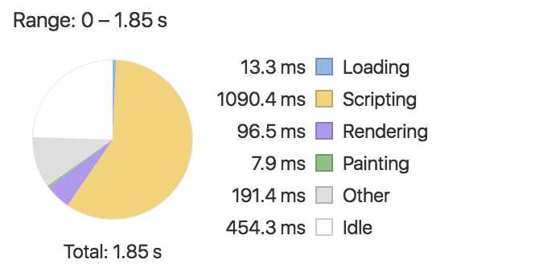

# Compilation in Angular

从`源代码`到`浏览器中可运行的程序`之间的过程都可以被认为是Compile过程，在Angular程序中，源代码中可能包含@Directive、@Component、@NgModule、@Pipe等各种内容，无论是TypeScript的Decorator还是Template中的Two-way data binding，这些最后都会变成可被浏览器解析的语言运行起来。

我们可以将整个compile过程简化为：

`Inputs(源代码)------Parser(解析器)----->Instantiate(实例化)`

在后面的文章中我们逐步来介绍这三部分在Angular中具体的工作和原理

**注意，按照Tobias Bosch的介绍，以下的代码应该是早期Angular 2实现的代码思想，不顾这并不妨碍我们理解整个Compiler工作的原理**

## Inputs(源代码)

由于篇幅有限，我们以Component和Directive的组合为例来进行介绍

hello.component.ts

```typescript
@Component({
  templateUrl:'hello_comp.html'
})
class HelloComp{
  user = {name:'Tobias'};
}
```

hello_comp.html

```html
<form>
  <div>Hello {{user.name}}</div>
  <input ngModel>
</form>
```

首先在HelloComp中定义了user的初始化值，并在template中渲染出来，在template中还包含了`ngModel`绑定的input。

我们将Directive代码也添加进来，Directive的selector支持css选择器，当在template代码中发现符合css选择器中的element时，就会实例化相应Directive。

```typescript
@Directive({selector:'form'})
class NgForm{...}
@Directive({selector:'[ngModel]'})
class NgModel{
  ...
  constructor(form:NgForm){...}
}
```

以上的简化代码也很容易理解，form和`[ngModel]`的selector分别在`<form>`标签和带有`ngModel`的attribute标签中生成了对应的Directive实例。值得一提的是在NgModel的directive中依赖了NgForm，这意味着NgModel的实例将在template的父元素中查找form依赖。

以上我们已经明确了原始代码的所有功能，这些被定义Component和Directive正是我们compiler的Inputs，下面就来介绍Compiler对代码的Parse过程

## Parser(解析器)

再关注一下之前的hello_comp.html

```html
<form>
  <div>Hello {{user.name}}</div>
  <input ngModel>
</form>
```

被parser翻译后的template应该对compiler更加友好，以AST(Abstract Syntax Tree)的方式对template中的HTML重新组织之后，我们可以获得以下的数据

```js
{
  name:'form',
  children:[
    {
      name:'div',
      children:[{text:'Hello'},{text:''}]
    },
    {
      name:'input',
      attrs:[['ngModel','']]
    }
  ]
}
```

以上的数据表示了HTML，相当简单易懂。而template中的binding可以用以下的数据结构表示

```js
{
  text:'',
  expr:{propPath:['user','name']},
  line:2,
  col:14
}
```

`text`代表着初始化的数据，因为依赖ts代码中的输入，所以默认为空。`expr`包含着Angular程序中在template的表达式信息，`propPath`中包含着数据的路径，当在expression中使用pipe或者*ngFor等代码时 ，`expr`中包含的内容会有更复杂的表现，`line`和`col`保留了binding中原始的位置信息，这点很重要，当template报错的时候可以精确告诉开发者template中哪一行代码发生了问题，如果你开发过Angular 2程序，你一定见过这种报错：

```bash
Uncaught EXCEPTION: Error in hello_comp.html: 2:14
Uncaught TypeError: Cannot read property 'name' of undefined
```

现在我们的Parser已经可以解析出Component的内容了，对于Directive又该如何表示呢，我们仍然可以在AST中进行表示

```js
{
  name:'input',
  attrs:[['ngModel','']],
  directives:[
    {
      ctor:NgModel,
      deps:[NgForm]
    }
  ]
}
```

以上我们已经将所有的代码parse成了对compiler友好的AST格式，下一步就是将parse得到的数据进行实例化，让App可以真正运行起来。

## Instantiate(实例化)

首先介绍NgElement的数据结构，NgElement是Angular 2中很重要的一部分，负责将AST转化回DOM结构，并完成相应的binding和Directive等内容的实例化。

```typescript
class NgElement{
  parrent:ngElement;
  doEl:HTMLElment;
  directives:map;
  constructor(parent:NgElment,ast:ElementAst){
  	this.domEl = document.createElement(ast.name);
  	ast.attrs.forEach((atrr)=>{
  		this.domEl.setAttribute(attr[0],atrr[1]);
	})
    parent.domEl.appendChild(this.domeEl);
  }
}
```

NgElement中的这部分代码相当简单，生成了AST中对应的DOM结构，并添加了对应attribute，针对Directive部分的处理如下，逐层实例化AST中的ctor和deps

```typescript
class NgElement{
  parrent:ngElement;
  doEl:HTMLElment;
  directives:map;
  getDirectiveDep(dirType){
  	if(this.directives.has(dirType)){
  		return this.directives.get(dirType);
	}
	return this.parent.getDirectiveDep(dirType);
  }
  createDirective(dirAst){
  	var deps = ast.deps.map((depType)=>this.getDirectiveDep(depType));
 	this.directives.set(ast.ctor,new ast.ctor(...deps));
  }
}
```

针对于Template中的binding部分，通过AST中的expr表达式来进行脏值检查，并将数据存储在target中，在Angular 2中最简单取出该值的方式就是`<div #testDiv></div>`，`testDiv`就是binding中的target，所有的数据都会存储在target中。

```typescript
class Binding{
  target: Node;
  targetProp: string;
  expr: BindingAST;
  lastValue: any;
  check(component:any){
   	try{
      var newValue = evaluate(this.expr,component);
      if(newValue !== this.lastValue){
        this.target[this.targetProp] = this.lastValue = newValue;
      }
	} catch(e){
      throw new Error(`Error in ${this.expr.line}:${this.expr.col}:${e.message}`);
	}
  }
}
```

最后我们会有View类来整合NgElement和binding中的脏值检查

```typescript
class View{
  component:any;
  ngElements: NgElment[];
  bindings: Binding[];
  dirtyCheck(){
  	this.bindigns.forEach(binding=>binding.check(this.component));
  }
}
```

通过以上的步骤，我们可以将Parser生成的AST转化为可以运行的App，然而Compiler的功能不仅仅是将源代码转换AST再转换为可运行程序，在compile的过程中对性能进行优化也是很重要的一步。

## Compiler性能优化

在NgElement对Directive处理的代码中，我们看到其中directives的类型是Map，如果我们将所有的directives都列举出来，将代码转换为

```typescript
class InlineNgElement{
  ...
  dir0,dir1,...:any;
  dirType0,dirType1,...:any;
  getDirecitveDep(dirType){
  	if(type === this.dirType0) return this.dir0;
  	if(type === this.dirType1) return this.dir1;
  	...
  }
}
```

这样的代码看起来可能很奇怪，多层If语句的可能会影响函数性能，但是Javascript V8的虚拟机的[Fast Property Access via Hidden Classes](https://github.com/v8/v8/wiki/Design%20Elements)机制却可以将这类代码进行很好的优化从而获得更高的性能。

我们将NgElement转换为InlineNgElement以获得更高的性能，然而我们的View类中却仍然含有大量的Array，如何让View也利用V8虚拟机的Fast Property优化，其实方法也很明确：我们只需要按正确的顺序初始化DOM，并且在Directive的初始化过程中也依照正确的顺序，保证被依赖的directive先被初始化生成就可以了。

初始化DOM结构

```typescript
function HelloCompView(component){
  this.component = component;
  this.node0 = document.createElement('form');
  ths.node1 = document.createElement('div');
  this.node0.appendChild(this.node1);
}
```

初始化Directive

```typescript
function HelloCompView(component){
  ...
  this.dir0 = new NgForm();
  ...
  this.dir1 = new NgModel(this.dir0);
}
```

再讲binding中的dirtyCheck对应到相应的node

```javascript
HelloCompView.prototype.dirtyCheck = function(){
  var v = this.component.user.name;
  if(v !== this.exprVal0){
    this.node3.ngModel = v;
    this.exprVal0 = v;
  }
}
```

通过以上的步骤，我们View全部可以利用Fast Property特性进行优化，当然所有的component的代码都需要根据component中directive和expression等内容单独生成，我们需要针对每个component生成单独的compile代码

```typescript
class CompileElement{
  domElProp:string = new PropertyVar();
  stmts: string[];
  constructor(parent:CompileElement,ast:ElementAst){
  this.stmts = [`
      this.${domElProp} = document.createElement('${ast.name}');
      this.${parent.domElProp}.appendChild(${this.domElProp});
  `]
  }
}
```

在以上的代码中，我们展示了Angular的Parser和Instantiate是如何协同工作的，通过优化Instantiate的代码，利用V8虚拟机的性能优化，Angular 2再次获得了将近1倍的性能提升。

然而有一个问题被我们忽略了，我们应该使用什么作为`Parser`？ 使用浏览器是个很好的主意，浏览器很适合用于解析HTML，在Angular 1和Angular 2中我们也的确可以使用浏览器作为Parser，这也就是JIT(Just In Time)编译的部分，所有的Compile过程全都是在浏览器端进行的。


如果我们可以将CompileElement的过程放在Server端，那浏览器端承载的工作量就会大幅度减少，相应的页面加载时间也会大幅度减少


Angular团队已经实现了可以在server端对代码进行parse的工具：[compiler-cli](https://github.com/angular/angular/tree/master/modules/@angular/compiler-cli)

官方提供的[angular-cli](https://github.com/angular/angular-cli)通过`ng serve --aot`和`ng build --prod --aot`也支持实时aot的实时预览与生产代码生成，github上的[angular2-aot-webpack](https://github.com/blacksonic/angular2-aot-webpack)项目提供了简单的webpack实现

用作者手中的一个Angular项目比对一下JIT和AoT的性能

JIT Compile


AoT Compile



效果感人


## 支持AoT

AoT优化虽然带来了相当大的性能提升，但是由于AoT的特性，部分在JIT模式下可用的方法在AoT下是不可行或者官方不建议的，在github上的[webpack2-starter](https://github.com/qdouble/angular-webpack2-starter/)总结了会导致AoT编译失败的情况：

- Don’t use require statements for your templates or styles, use styleUrls and templateUrls, the angular2-template-loader plugin will change it to require at build time.
- Don’t use default exports.
- Don’t use form.controls.controlName, use form.get(‘controlName’)
- Don’t use control.errors?.someError, use control.hasError(‘someError’)
- Don’t use functions in your providers, routes or declarations, export a function and then reference that function name
- Inputs, Outputs, View or Content Child(ren), Hostbindings, and any field you use from the template or annotate for Angular should be public


## It's just "Angular"

尾巴

Angular官方在2016年12月13日宣布了一个非常"耸人听闻"的消息：将在2017年3月份跳过3.0版本正式release Angular 4.0。不过Angular官方随后快速放出了定心丸，4.0版本只不过是Angular团队将命名方式切换为Semantic Versioning([SEMVER](http://semver.org/))，并且向下兼容2.0，这么一看就很容易理解了，React的版本号都已经15了，Angular的版本到4.0也没有什么大惊小怪的。

另外一个问题就是3.0版本去哪了，一路从rc版本使用Angular 2.0的用户都知道@angular/router曾经废弃掉了一个版本，这样目前的版本号就变得很尴尬，`@angular/core`,`@angular/compiler`,`@angular/http`等版本号都是保持一致的，而`@angular/router`的版本号却永远高出一个版本，当主版本号是2.3.1时，router的版本号却已经是3.3.1了，为了保持版本一致，Angular将越过3.0版本直接统一从4.0开始。

为了避免各种Angular版本号给开发者造成不必要的误解，也为了避免整个社区割裂，Angular团队号召大家在非必要情况下忽略版本号，比如：我是一个Angular开发者，这是一个Angular会议，Angular的生态系统发展很快等等。在培训和介绍的时候使用版本号，例如本文介绍的内容就是针对于Angular 2版本的。


##### 参考资料

    [1​]: http://juristr.com/blog/2016/12/let-me-explain-angular-release-cycles/	"it's going to be Angular 4.0, or simply Angular"
    [2​]: https://youtu.be/kW9cJsvcsGo	"The Angular 2 Compiler Tobias Bosch"
    [​3]: http://blog.mgechev.com/2016/08/14/ahead-of-time-compilation-angular-offline-precompilation/	"Ahead-of-Time Compilation in Angular"
    [​4]: https://angular.io/docs/ts/latest/cookbook/aot-compiler.html	"AHEAD-OF-TIME COMPILATION"
    [5​]: https://github.com/v8/v8/wiki/Design%20Elements	"V8 Design Elements"