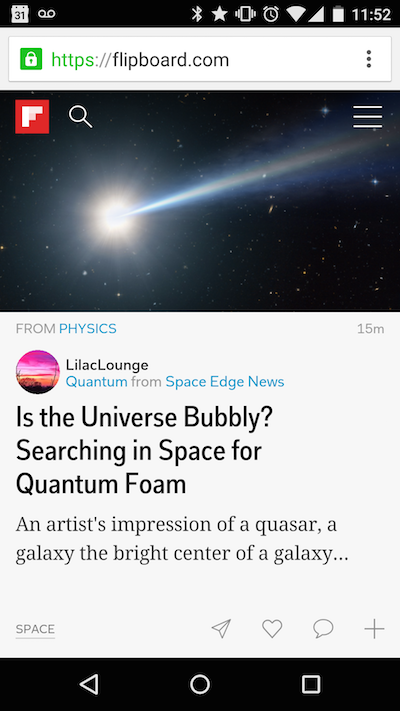
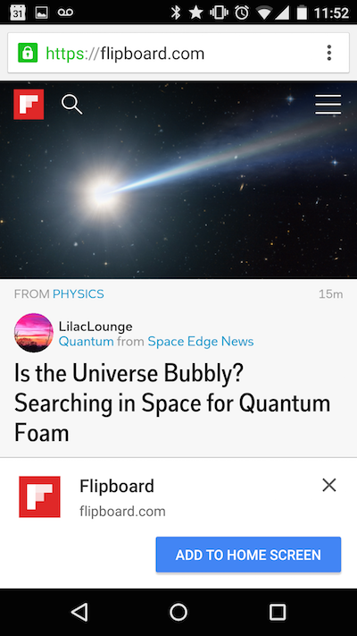
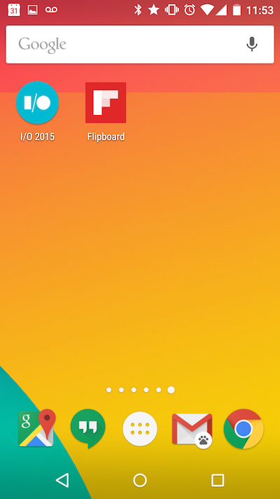
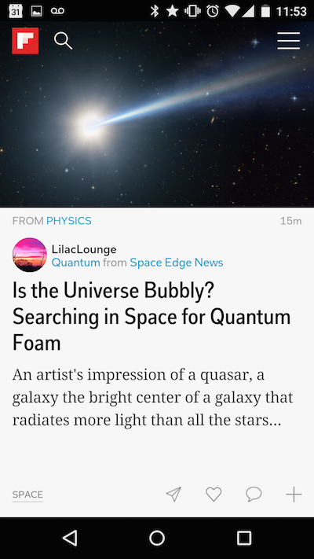
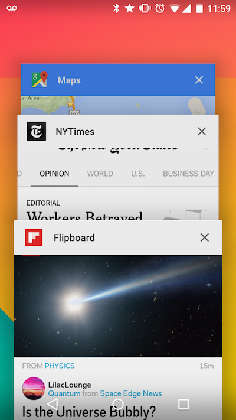

# 浅谈微信小程序与PWA

作为一个程序员，你这两天的朋友圈被微信小应用刷屏了吧？想试了吧？没拿到邀请吧？没关系，我来帮你！

当然，我没法帮你拿到邀请码 —— 因为我也没有。不过，别失望，我今天要跟大家谈一项比微信小程序更宏观的概念 —— Google提出的PWA。

## PWA是什么？

PWA全称是“Progressive Web Apps”，译成中文就是渐进式应用。这是Google在2015年6月15日提出的概念，参见Alex Russell写的<https://infrequently.org/2015/06/progressive-apps-escaping-tabs-without-losing-our-soul/>。

那么，什么是渐进式应用呢？

Alex写道：

>在昨天的晚餐上，我和Frances列举出了新型应用的几个特征：
>- 响应式：适应任何形态因素
>- 不依赖网络：在Service Worker（H5中的新技术，appcache的升级版）的支持下能够离线使用
>- 像本地应用一样交互：采用“壳+内容”模式来实现类似本地应用的浏览和交互体验
>- 保持最新：始终透明的升级到最新版，这要感谢Service Worker提供的升级机制
>- 安全：通过TLS（这是Service Worker所要求的）来防止通讯被窥探
>- 可发现的：具有像“应用”一样的唯一标识，这要感谢W3C的Manifest文件格式，它在“Service Worker”中注册的scope能允许搜索引擎发现这些应用。
>- 可“再接触”的：可以访问操作系统的“可再接触”界面，比如推送通知
>- 可安装的：通过浏览器提供的提示，可以把它加入主屏，允许用户把觉得有用的应用“保留”下来，而不用到应用商店去安装，那样太麻烦了。
>- 可链接的：这意味着它们是零阻力、零安装，并且易于共享的。URL更能发挥社交传播的能量。

## PWA怎么用？

一个PWA的使用过程大概是这样的：

### 这货开始就是一个普通网页：

### 然后，这是什么鬼？

### 这网站看着还不错，那就接受吧！

### 它出现在手机的首屏了，以后随叫随到！

### 点了就能像一个本地应用那样启动它：

### 看，启动完也跟一个本地应用没有区别：

## PWA的好处

Web应用（网页）和本地应用（App）各有优势，比如：

- Web应用不需要安装，因此减少了用户流失（想想你要安装一个应用时有多么犹豫吧）
- Web应用方便传播，你只要在微信或者QQ里发一个网址就有很多人会去看（比如本文 ^_^）
- Web应用的收藏、前进、后退这些功能非常有用
- 本地应用的留存度比较高。你看过一个网址后再回来的概率大约是本地应用的1/3。
- 本地应用可以推送通知，而Web应用只有在浏览器打开状态下才行
- 本地应用可以离线使用，只要做适当的设计就可以不受网络环境的影响
- 本地应用可以访问更加丰富的功能，比如更大的本地存储空间

那么，它们能否合二为一呢？这就是PWA所做的事！

通过前面提到的这些步骤，PWA可以让用户同时获得这两种好处。这无论对于用户本身还是对于应用的开发者都非常有意义。

## 如何实现PWA？

其实从Alex的描述中就可以看到，在技术上我们离实现PWA并不远：

### Web应用开发技术

已经具备。

特别是得益于Angular等SPA应用的普及，SPA不但响应更加快速，更加接近原生应用的操作体验，而且让我们可以完全不依赖服务器工作了。

### 离线存储技术

有人可能还记得一项叫AppCache的技术，它已经废弃了，现在由Service Worker所取代。这是一个更强大的AppCache，它不仅能存储HTML/JS等静态文件，而且还让你能够在客户设备上运行起一个仿真的超轻量级Web服务器，你在里面已经几乎可以写Node程序了！

这是新的H5标准的一部分，而不是PWA特有的。

### 推送通知

H5标准中已经有了用来推送通知的API（用过Web Gmail的话应该见过），现在只要把它和操作系统的API对接就行了。当然，这最好由操作系统提供支持，这已经实现了，那就是新推出的Android 7。

### App壳程序

这个壳程序其实自己来实现也没问题，技术上没啥难度，不过不用重复造轮子了，因为官方已经出了一个，参见<https://github.com/GoogleChrome/application-shell>。如果用Angular 2就更幸福了，因为Angular 2还制作了一个Angular 2专用的壳：<https://github.com/angular/mobile-toolkit>。不过，它现在还处于未发布状态，早鸟可以开始提前尝试了。

## 微信小程序与PWA

虽然微信小程序概念的提出比PWA晚了半年，不过相信张小龙这个级别的产品经理不会是简单的抄袭PWA概念，而是会发挥微信生态圈的优势，提供更广阔的应用场景。或许我们应该把微信小程序看做PWA的一种优质实现。

假如你没有拿到微信小程序的邀请码，不妨像我一样，先从研究PWA开始吧。
