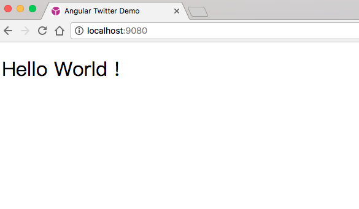

# Angular 2从零开始系列 - 00

本系列将会从零开始构建一个完整的Angular项目，最终实现一个简易版的twitter，不依赖任何seed或starter，也不使用Angular cli，这样做的目的是让自己对Angular应用开发的每一个环节都有一定的了解

最终的示例会包含以下特性：

- 采用`webpack`进行构建、编译、模块打包
- 模板采用`pug`编写，并支持分环境配置全局模板变量
- 样式采用`less`编写，并支持分环境配置全局less变量
- 路由懒加载
- 通过`npm script`『一键』创建组件相关目录和文件
- 模块热替换(hot module replacement)
- 多国语言支持
- 动态加载组件
- AoT编译
- 服务端渲染

希望对大家能有所帮助

&nbsp;

___序章___

## 基础知识

- NPM <https://www.npmjs.com>
- ES6 <http://es6.ruanyifeng.com>
- Webpack <https://webpack.js.org>
- Angular <https://angular.cn>

以上内容是我认为在开始动手之前必须要有一定了解的，不必精通，浏览一遍各自的文档，理解其核心概念即可

那么这里为什么没有提`TypeScript`呢？因为根据我的实践经验，有`ES6`的基础的话，不必系统学习`TypeScript`，开发中遇到其特有的功能时进行针对性的查阅就行了

## 创建项目

### 环境

我们采用`npm`来管理依赖，`NodeJS`运行环境当然是必不可少的，所以第一步就是安装`NodeJS` <https://nodejs.org/>

另外介于国内的网络环境，推荐使用淘宝的npm镜像：<https://npm.taobao.org/>，请按照网站上的说明进行配置

### 初始化

- 打开终端(Windows用户建议使用[git-bash](https://git-scm.com/downloads))：

```bash
mkdir angular-twitter
cd angular-twitter
npm init #可按照提示填写项目基本信息，或直接一路回车
```

- 安装依赖：

```bash
# Angular
npm install @angular/common @angular/compiler @angular/compiler-cli @angular/core @angular/forms @angular/http @angular/platform-browser @angular/platform-browser-dynamic @angular/platform-server @angular/router rxjs zone.js core-js --save

# Webpack
npm install webpack --save-dev

# TypeScript
npm install typescript --save-dev

# TypeScript loader for webpack
npm install awesome-typescript-loader --save-dev
```

注意这些并不是最终全部的依赖，随着开发的进展，后面会陆续添加其他依赖

- 目录结构：

```text
anuglar-twitter/
├── src/ 
    ├── app/
    ├── index.html
    ├── tsconfig.json
├── webpack.config.js
├── package.json     
```
其中：
- `src`目录存放我们的ts及模板等源文件
- `./webpack.config.js`是webpack的配置文件 
- `./package.json`是最开始执行`npm init`之后生成的 
- `./src/tsconfig.json`是typescript的配置文件
- `./src/index.html`是主页面
- `./src/app`则是我们app的具体代码喽

### Hello world!

接下来我们先实现一个hello world，首先创建app的入口模块及根组件(假设你已经阅读了Angular官方的快速起步和开发指南，没有的话请移步<https://angular.cn>)，在`./src/app/`目录下创建如下文件：

|文件名|说明|
|---|---|
|app.module.ts|入口模块|
|app.component.ts|根组件|
|app.template.html|根组件模板|
|app.styles.css|根组件样式|

```js
//app.module.ts

import {NgModule} from "@angular/core";
import {AngularTwitterAppComponent} from "./app.component";
import {BrowserModule} from "@angular/platform-browser";
@NgModule({
  imports: [
    BrowserModule
  ],
  declarations: [
    AngularTwitterAppComponent
  ],
  providers: [],
  bootstrap: [AngularTwitterAppComponent]
})
export class AppModule {

}
```
```js
//app.component.ts

import {Component} from "@angular/core";
@Component({
  selector: 'angular-twitter-app',
  templateUrl: './app.template.html',
  styleUrls: ['./app.styles.css']
})
export class AngularTwitterAppComponent {

}
```
```html
<!-- app.template.html -->
<h1>Hello World !</h1>
```
```css
/* app.styles.css */
h1 {
  font-weight: normal;
}
```

然后在`./src`创建app的启动文件`main.ts`
```js
import 'core-js'; // es6+es7 polyfills
import 'zone.js/dist/zone.js'; // Angular所依赖的zone.js，必须在core-js之后加载

import {AppModule} from "./app/app.module";
import {platformBrowserDynamic} from "@angular/platform-browser-dynamic";
platformBrowserDynamic().bootstrapModule(AppModule);
```

修改`./src/tsconfig.json`
```json
{
  "compilerOptions": {
    "target": "es5",
    "module": "es6",
    "experimentalDecorators": true,
    "moduleResolution": "node",
    "lib": [
      "dom",
      "es6"
    ],
    "typeRoots": [
      "node_modules/@types"
    ],
    "types": [
      "node"
    ]
  }
}
```
`tsconfig.json`中各个字段的说明：

|字段名|值|说明|
|---|---|------|
|target|es5|编译目标，将ts文件编译成符合es5规范的js代码|
|module|es6|编译目标采用es6的模块管理方式，目的是能够利用webpack和es6模块导入的特性来做tree-shaking|
|experimentalDecorators|true|使用实验性的装饰器，这个是必须的设置，因为Angular的源码中使用了它|
|moduleResolution|node|由于我们使用了node的包管理工具npm来下载依赖，所以这里也是必须的设置，<br>否则在ts中导入node_modules目录下的模块时，ts编译器会找不到它|
|lib|["dom","es6"]|同样是必须的设置，否则用到es6的地方编译会报错|
|typeRoots|["node_modules/@types"]|参考<br><https://www.tslang.cn/docs/handbook/tsconfig-json.html#types-typeroots-and-types>|
|types|["node"]|为`require`等方法提供类型支持，需要先安装`@types/node`<br>(在项目根目录下执行`npm install @types/node --save`)

&nbsp;

修改`webpack.config.js`：
```js
module.exports = {
  entry: {
    'app': './src/main.ts' //入口文件
  },

  output: {
    path: './src', //生成打包文件的目录
    filename: '[name].bundle.js' //打包文件的名字，本例中将是`app.bundle.js`
  },

  resolve: {
    extensions: ['.js', '.ts'] //这样配置在import的时候，就可以省略.js和.ts的后缀了
  },

  module: {
    rules: [
      {
        test: /\.ts$/,
        use: [
          {
            loader: 'awesome-typescript-loader', //编译ts的loader
            options: {
              configFileName: './src/tsconfig.json' //配置tsconfig.json的路径
            }
          },
          'angular2-template-loader' 
          // angular2-template-loader会把Angular组件中的templateUrl和styleUrls替换成template和styles，
          // 并添加require，参考<https://github.com/TheLarkInn/angular2-template-loader>
          // 当然需要先安装它：在项目根目录下执行`npm install angular2-template-loader --save-dev`
        ]
      },
      {
        test: /\.(css|html|htm)$/, 
        use: 'raw-loader' //对于css、html、htm直接取得其文本内容，在之后的文章里会分别替换成less和pug
      }
    ]
  }
};
```

修改`./src/index.html`：
```html
<!doctype html>
<html>
<head>
  <meta charset="UTF-8">
  <meta name="viewport" content="width=device-width, user-scalable=no, initial-scale=1.0, maximum-scale=1.0, minimum-scale=1.0">
  <meta http-equiv="X-UA-Compatible" content="ie=edge">
  <title>Angular Twitter Demo</title>
</head>
<body>
  <angular-twitter-app>Loading...</angular-twitter-app>
  <!--注意下面引用的是webpack打包生成的文件-->
  <script type="text/javascript" src="app.bundle.js"></script>
</body>
</html>
```

最后，我们通过npm scripts来写一段脚本执行打包和启动一个静态服务器（更多关于npm scripts的信息请参考<https://docs.npmjs.com/files/package.json>以及<https://docs.npmjs.com/misc/scripts>）

修改`./package.json`:
```json
{
  "name": "angular-twitter",
  ...
  "scripts": {
    "webpack": "webpack --config ./webpack.config.js --bail --progress",
    "server": "static-server ./src",
    "start": "npm run webpack && npm run server"
  },
  ...
}
```
其中`scripts.webpack`中的命令参数说明：

|参数|说明|
|---|---|
|--config|指定配置文件路径|
|--bail|当打包时遇到第一个错误就立刻中断打包|
|--progress|显示打包进度|

更多的参数说明请参考<https://webpack.js.org/api/cli/>

`scripts.server`中用到了一个新的node模块`static-server`，所以我们需要在项目根目录下执行`npm install static-server --save-dev`

好啦！现在我们可以在项目根目录下执行`npm start`来试试看了！

执行`npm start`之后若看到如下的提示，就说明已经打包成功并且启动了静态服务：
```bash
* Static server successfully started.
* Serving files at: http://localhost:9080
* Press Ctrl+C to shutdown.
```

现在用浏览器打开`http://localhost:9080`：



序章到此就结束了，下一章将引入`pug`和`less`，以及通过`webpack`的`file-loader`来处理模板和样式中对图片等静态资源的引用。

示例源码：<https://github.com/indooorsman/angular-twitter>
