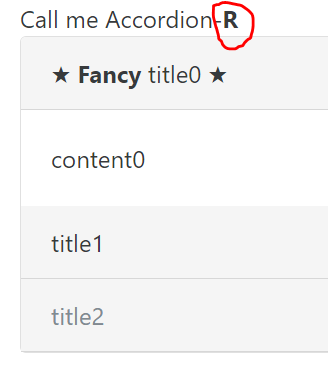

# 使用 Angular 2 制作简单的 Accordionr 组件 - Model Driven

## 写作原因
Angular 的文档翻了一遍又一遍，还是记不住，边用边学效果会不会好一些？设个小目标吧 -- 比如，制作一个 Accordionr 组件。  
我们知道，Angular 的 form 有两种：
- [template driven form](https://scotch.io/tutorials/using-angular-2s-template-driven-forms)，几乎可以把所有的数据和逻辑（比如 validation）都放在 template 里；
- [model driven form](https://scotch.io/tutorials/using-angular-2s-model-driven-forms-with-formgroup-and-formcontrol)（或者叫 reactive form），template 很简单，数据和逻辑放在 model 里。

组件的制作也可以参照这两种不同的思路。本篇是一个系列的下集，即按照 model driven 思路，应用 Angular 2 制作一个 Accordionr 组件。而上集应用了 template driven 思路。  
（Accordion 后面跟一个 r，这个 r 是 reactive 的意思，reactive 是 model driven 的意思，大家别误会。）  

## 读者指引
- 笔者的偏见：model driven 大法好。大家可以对比上集的代码长度和知识点列表长度，就很容易得出结论了。

- 本文涉及到的知识点：
    - NG2 - 了解 [模板语法](https://angular.cn/docs/ts/latest/guide/template-syntax.html)。
    - NG2 - 了解 ngFor 的展开写法（模板语法的一小部分）（参见 trotyl 的《[Angular 2 中的 Sturctural Directive](https://wx.angular.cn/library/article/Angular2%E4%B8%AD%E7%9A%84StructuralDirective)》）：  
        一般我们都是写 `<div *ngFor="let panel of panels">...</div>`，展开后是

        ```html
        <template ngFor let-panel [ngForOf]="panels">
          <div class="card">...</div>
        </template>
        ```

        上面的代码会将 `.card` 按 panel 循环。这里只有 `.card` 一个元素。如果我们需要同时循环多于一个元素的时候，`*ngFor` 这样含有星号的写法就行不通了，只能使用展开写法，即
        
        ```html
        <template ngFor let-panel [ngForOf]="panels">
          <div class="card-header">...</div>
          <div class="card-block">...</div>
        </template>
        ```
    - NG2 - 大概知道 [Angular Animation](https://angular.cn/docs/ts/latest/guide/animations.html)。
    - NG2 - 大概知道 [Angular Testing](https://angular.cn/docs/ts/latest/guide/testing.html)。

- 文章使用 angular-cli 的 [generate 指令](https://github.com/angular/angular-cli#generating-components-directives-pipes-and-services)（简写为 `ng g`）来生成基础代码。

- 相应代码可以在[这个 Repo](https://github.com/rxjs-space/try-out-u/tree/master/src/app/tl-ui/tl-accordionr) 找到。

## 小目标
我们希望呈现的效果是：  
  
初始显示 content0；点击 title1，展开 content1，收起 content0；点击 title2，什么也不做，因为 panel2 是 disabled。

这背后是一个 accordionr （最后有个 r) component，另外需要 app.component 提供数据，`Panel` interface 在 accordionr 组件目录里设定。
```html
<!-- app.component.html -->
<tl-accordionr [expandOneOnly]="true" [panels]="panels"></tl-accordionr>
```

```ts
// app.component.ts
export class AppComponent {
  private panels: Panel[] = [
    {title: '<span>&#9733; <b>Fancy</b> title0 &#9733;</span>', content: 'content0', expanded: true},
    {title: 'title1', content: 'content1'},
    {title: 'title2', content: 'content2', disabled: true}, ]; }
```
即 accordionr component 负责根据 `@Input() panels` 来显示。  

几点不那么重要的旁注：
- tl 是前缀，前缀可以是随便什么。
- expandedOneOnly 是用来初始化的，后面具体说明其功能。
- title 和 content 可以是 html 代码，比如 `AppComponent.panels[0].title`。
- 这里不讨论上面的这样的组件结构是否是最优的、是否应该使用 attribute directive 等等，只以实现这个写法为努力方向。   

## 代码编写

### 脚手架搭建（生成基础代码）
我们需要的组成部分包括：accordionr component、config service，还有一个 interface 文件。
```
> ng g module tl-accordionr
... (生成 TlAccordionrModule 以及 TlAccordionrComponent)
> ng g service tl-accordionr/tl-accordionr-config
> （假设当前目录为 app）touch tl-accordionr/tl-accordionr.interface.ts
```
然后在 TlAccordionrModule 里，加上 `exports: [TlAccordionrComponent]`，在 app.module 里加上 `imports: [TlAccordionrModule]`，就可以开始在 app.component.html 里面使用 tl-accordionr 标签了。  
生成 TlAccordionrModule 这个 ngModule 的目的是：预留 provider 位置，方便以后配置全局变量，比如要求 app 里所有的 accordionr 都是怎么怎么样的。

### 实现 accordionr 组件显示 panels
```ts
// tl-accordionr.component.ts
export class TlAccordionrComponent {
  @Input() private panels: Panel[] = []; }
```

```html
<!-- tl-accordionr.component.html -->
<div class="card">
  <template ngFor let-panel [ngForOf]="panels">
    <div role="tab" class="card-header" [innerHTML]="panel.title"></div>
    <div role="tablpanel" class="card-block" [innerHTML]="panel.content"></div>
  </template>
</div>
```
（role 和 class 配合 bootstrap 使用）这样，在 app.component.ts 里定义的 panels 就都显示出来了，一视同仁，不论 expanded、disabled。

### 实现按 expanded、disabled 设置来显示 panels
- 需求一：可以按照 app.component.ts 里定义的 expanded、disabled 来初始化 panels；
- 需求二：点击 title后，toggle content；
- 需求三：如果是 disaled panel，不渲染 content。  

```html
<!-- tl-accordionr.component.html -->
  <div role="tab" class=... [innerHTML]=...
    (click)="onTitleClick(panel)"
    [class.text-muted]="panel.disabled" ></div>
  <div role="tabpanel" class=... [innerHTML]=...
    [style.display]="panel.expanded ? 'inherit' : 'none'"
    *ngIf="!panel.disabled" ></div>
```

```ts
// tl-accordionr.component.ts
export class TlAccordionrComponent {
  ...
  onTitleClick(panel: Panel) {
    if (!panel.disabled) {
      panel.expanded = !panel.expanded; // 需求二
    } }}
```

### 实现 expandOneOnly
如果 accordionr 的 expandOneOnly 属性为 true，那么同一时间只允许有一个 panel 是展开的。  
- 需求四：accordionr component 记录了'点击之前展开着的 panel'；
- 需求五：在点击某个 title 以后，accordionr component 对比 '被点击 panel' 与'点击之前展开着的 panel'，如果不相同，收起 '点击之前展开着的 panel'，并重置 '点击之前展开着的 panel'。  

```ts
// tl-accordionr.component.ts
export class TlAccordionrComponent implements OnInit {
  @Input() private expandOneOnly: boolean = false;
  ...
  private lastExpandedPanel: Panel; // 需求四

  ngOnInit() { // init lastExpandedPanel
    this.lastExpandedPanel = this.panels.filter(panel => panel.expanded)[0]; } // 需求四
  
  onTitleClick(panel: Panel) {
    if (!panel.disabled) {
      ...
      if (this.lastExpandedPanel !== panel && this.expandOneOnly) { // 需求五
        this.lastExpandedPanel.expanded = false;
        this.lastExpandedPanel = panel;
      } }}}
```

### 实现全局配置 app 内所有 accordionr
- 需求六：我们需要一个 config service。
- 需求七：将 config service 添加到 accordionr module 的 providers 列表里。
- 需求八：在 accordionr component 里注入这个 config service。
- 需求九：可以在 app.module 里替换这个 config service。
- 需求十：可以不提供 config service。

```ts
// tl-accordionr-config.service.ts 需求六
@Injectable()
export class TlAccordionrConfigService {
  expandOneOnly = false; }

// tl-accordionr.module.ts 需求七
export class TlAccordionrModule {
  static withProviders(): ModuleWithProviders {
    return {
      ngModule: TlAccordionrModule,
      providers: [TlAccordionrConfigService] }}}

// tl-accordionr.component.ts 需求八
export class TlAccordionrComponent implements OnInit {
  @Input() private expandOneOnly: boolean; // 不再默认为 false
  ...
  constructor(private config: TlAccordionrConfigService) { } // 注入 config service
  ...
  ngOnInit() {
    // init expandOneOnly，如果 app.component.html 里没有设定，用 config service
    if (typeof this.expandOneOnly === 'undefined') {
      this.expandOneOnly = this.config.expandOneOnly;
    } ...}...}

// app.module.ts 使用默认 config service
imports: [TlAccordionrModule.withProviders()]

// app.module.ts 替换默认 config service 需求九
imports: [TlAccordionrModule.withProviders()]
providers: [{provide: TlAccordionrConfigService, useValue: TlAccordionrConfigServiceAlternative}]

// 需求十，大家试试看（提示： 在 accordionr component 的 constructor 里使用 @Optional() ...）
```

### 添加 Amination
```html
<!-- tl-accordionr.component.html -->
<div role="tabpanel" class=... [innerHTML]=...
  [@contentState]="expanded ? 'expanded' : 'collapsed'"
  *ngIf="..."></div>
```

```ts
// tl-accordionr-panel.component.ts
@Component({..., animations: [trigger('contentState', [...])] })
export class TlAccordionrPanelComponent {
  @Input() private animation: boolean = false;
}
```
有需要的同学可以参考 [angular.cn 里 animation 的文档](https://angular.cn/docs/ts/latest/guide/animations.html)来实现动画效果。另外，可以给 accordionr component 添加一个 `@Input() animation: boolean` 开关（config.service 里也要添加），用户可以控制是否显示动画。

### 测试

- 配置 TestHostComponent：
  ```ts
  @Component({template: `
      <tl-accordionr [expandOneOnly]="true" [panels]="panels"></tl-accordionr>`})
  class TestHostComponent {
    panels = [ ... ]; }
  ```

- 测试是否可以按照 TestHostComponent 配置来初始化：
  ```ts
  it('should initialize with TestHost setup', () => {
    expect(accordionComponent['expandOneOnly']).toBe(true);
    expect(accordionComponent['panels']).toEqual(componentHost.panels);
    expect(accordionComponent['lastExpandedPanel']).toEqual(componentHost.panels[0]);  });
  ```

- 测试点击某个 panel 的 title 之后，是否可以 toggle 这个 panel，并设置其他 panel：
  ```ts
  it('should act as expected when click on title', () => {
    const titleElArr = fixtureHost.debugElement.queryAll(By.css('tl-accordionr .card-header'));
    const contentElArr = fixtureHost.debugElement.queryAll(By.css('tl-accordionr .card-block'));

    expect(accordionComponent['panels'][0].expanded).toBe(true); // [0] is expanded initially
    titleElArr[1].triggerEventHandler('click', {}); // click on [1]
    fixtureHost.detectChanges();
    // ... expect * 20
  });
  ```

- 测试 amination 过后的 dom element 状态，可能会用到 [fakeAsyc、tick](https://angular.io/docs/ts/latest/api/core/testing/index/fakeAsync-function.html)。比如：
  ```ts
  it('should has style.display as ... after animation', fakeAsync(() => {
    ...
    titleElArr[1].triggerEventHandler('click', {}); // click on [1]
    fixtureHost.detectChanges();
    ...
    tick(500); // 假设我们的 animation 0.5 秒演完，假装我们等他 0.5 秒
    // expect * 1000 }));
  ```

### 发布到 NPM
tl-accordionr module 写好了，请别人来试试吧。你可以： 
- zip 一下发个邮件，然后告诉朋友 upzip 之后怎么怎么样 ...
- 或者发布到 NPM，然后告诉朋友 `npm i tl-accordionr` ...

后续文章会简单介绍如何将使用 angular-cli 做好的 module 发布到 NPM 上。

## 总结
按照 model driven 的思路制作组件，组件内部逻辑清晰，容易写，方便看，测试也简单。  

