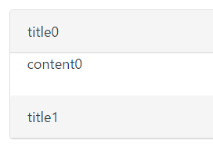

# 使用 Angular 2 制作简单的 Accordion 组件 - Template Driven

## 写作原因
Angular 的文档翻了一遍又一遍，还是记不住，边用边学效果会不会好一些？设个小目标吧 -- 比如，制作一个 Accordion 组件。  
我们知道，Angular 的 form 有两种：
- [template driven form](https://scotch.io/tutorials/using-angular-2s-template-driven-forms)，几乎可以把所有的数据和逻辑（比如 validation）都放在 template 里；
- [model driven form](https://scotch.io/tutorials/using-angular-2s-model-driven-forms-with-formgroup-and-formcontrol)（或者叫 reactive form），template 很简单，数据和逻辑放在 model 里。

组件的制作也可以参照这两种不同的思路。本篇是一个系列的上集，即按照 template driven 思路，应用 Angular 2 制作一个 Accordion 组件。下集将切换至 model driven/reactive 思路。

## 读者指引
- 首先剧透笔者的一个偏见：model driven 大法好。template driven 的组件除了标签一目了然以外，我个人觉得都是缺点：写起来麻烦，读起来费劲，css匹配奇怪，测试起来...（这个 spec 我还没写过）。所以，即使你对制作组件如果有兴趣，我也只建议大概看一下本文，了解“子组件向父组件推送、子组件之间的互动由父组件来协调”即可。
- 本文内容很大程度上受到下列的文章、代码的启发，有兴趣的同学可以先翻阅一下：
    - [Angular 2 Transclusion using ng-content][]（NG1 的 Transclusion 在 NG2 里改名为 content projection）
    - [ng-bootstrap/accordion api][]、[源码][ng-bootstrap/accordion src]

- 本文涉及到的知识点（没有链接的项目大家可以在相应的官方文档里找到）：
    - NG2 - 内容投影（content projection）：使用 ng-content 标签，配合 select 属性（参看上面那个 《...using ng-content》）。
    - NG2 - 生命周期钩子（lifecycle hooks）：ngAfterContentInit、ngOnDestroy。
    - NG2 - ContentChildren 装饰器。
    - ES6 - [展开运算符（spread operator）][展开运算符]。
    - RxJS - Subject
    - RxJS - Observable.merge
    - RxJS - Observable.prototpye.filter

- 文章使用 angular-cli 的 [generate 指令][]（简写为 `ng g`）来生成基础代码。

- 变量命名：Suject 变量以 Rxx 结尾（比如 stateRxx），Observable 变量以 Rx 结尾（比如 mergedPanelStatesRx）。

- 相应代码可以在[这个 Repo](https://github.com/rxjs-space/try-out-u/tree/master/src/app/tl-ui/tl-accordion) 找到。

## 小目标
我们希望呈现的效果是：  
  
初始显示 title0、content0、title1；点击 title1，显示 content1，隐藏 content0；点击 title0，显示 content0，隐藏 content1。

这背后是一个 accordion component，可以在 template 里这样使用（不需要在 app.component.ts 里做任何事）：  

```html
<!-- app.component.html -->
<tl-accordion [expandOneOnly]="true">

  <tl-accordion-panel [expanded]="true">
    <tl-accordion-panel-title>title0</tl-accordion-panel-title>
    <tl-accordion-panel-content>content0</tl-accordion-panel-content>
  </tl-accordion-panel>

  <tl-accordion-panel>
    <tl-accordion-panel-title>title1</tl-accordion-panel-title>
    <tl-accordion-panel-content>content1</tl-accordion-panel-content>
  </tl-accordion-panel>

</tl-accordion>
```
即 accordion 下面有若干 panel，每个 panel 有一个 title 和一个 content。  
几点不那么重要的旁注：
- tl 是前缀，前缀可以是随便什么。
- expandedOneOnly 和 expanded 这两个属性写在 template 里是用来初始化的，后面具体说明其功能。
- title0 和 content0 可以是 html 代码，比如 `<div>...</div>`。
- 这里不讨论上面的这样的组件结构是否是最优的、是否应该使用“结构 directive”等等，只以实现这组标签的写法为努力方向。   


## 代码编写

### 脚手架搭建（生成基础代码）
我们需要的 component 包括：accordion、panel、panel-title、panel-content，另外还需要一个 interface 文件。
```
> ng g module tl-accordion
... (生成 TlAccordionModule 以及 TlAccordionComponent)
> ng g component tl-accordion/tl-accordion-panel
... (生成 TlAccordionPanelComponent)
> ng g component tl-accordion/tl-accordion-panel-title
... (生成 TlAccordionPanelTitleComponent)
> ng g component tl-accordion/tl-accordion-panel-content
... (生成 TlAccordionPanelContentComponent)
> （假设当前目录为 app）touch tl-accordion/tl-accordion.interface.ts
```
然后在 TlAccordionModule 里，加上 `exports: [TlAccordionComponent]`，在 app.module 里加上 `imports: [TlAccordionModule]`，就可以开始在 app.component.html 里面使用 tl-accordion 等标签了。  

我们需要 accordion component，但用的指令是 ng g module，即同时生成了 accordion module 和 accordion component。这样做的目的是预留 provider 位置（在 module 里），方便以后配置全局变量，比如要求 app 里所有的 accordion 都是怎么怎么样的（仿照 ng-bootstrap的做法）。  

注：因为像 TlAccordionPanelContentComponent 这样的名字太长，后文会用最后两个词（即 content component）代替。

### 实现 title 组件显示 title，content 组件显示 content
要显示 `<tl-accordion-panel-title>This is a title.</tl-accordion-panel-title>` 里的 'This is a title.'，我们只需要在 title component 的 template 里写一行：`<ng-content></ng-content>`。content component 同理。完。

### 实现 pannel 组件显示 title 和 content
我们在 app.component.html 里写道：  

```html
<!-- app.component.html -->
<tl-accordion-panel>
  <tl-accordion-panel-title>title</tl-accordion-panel-title>
  <tl-accordion-panel-content>content</tl-accordion-panel-content>
</tl-accordion-panel>
```
要将 tl-accordion-panel-title 和 tl-accordion-panel-content 的内容在 tl-accordion-panel 里面显示出来，我们需要两个 ng-content，分别放置 title 和 content。在 panel component 的 template 里写：  

```html
<!-- tl-accordion-panel.component.html -->
<div role="tab" class="card-header">
  <ng-content select="tl-accordion-panel-title"></ng-content>
</div>
<div role="tablpanel" class="card-block">
  <ng-content select="tl-accordion-panel-content"></ng-content>
</div>
```
role 和 class 是抄来的（配合 bootstrap 使用），重点是 ng-content 的 select 属性 -- select 里面是选择器，`select="tl-accordion-panel-title"` 的意思是：选择 tag 为 tl-accordion-panel-title 的元素，并将其内容放置到这个 ng-content 里面。tl-accordion-panel-content 同理。

### 实现 click on title => toggle content （ panel 内部解决）
承接上面的 `tl-accordion-panel.component.html`，我们需要实现能够初始化是否显示 `.card-block`，并且在点击 `.card-header` 时，切换 `.card-block` 的显示。可以这样： 

```typescript
// tl-accordion-panel.component.ts
export class TlAccordionPanelComponent {
  @Input() expanded: boolean = false;
}
```
初始化就是：

```html
<!-- app.component.html -->
<tl-accordion-panel [expanded]="true">...</tl-accordion-panel>
```

点击切换就是：  

```html
<!-- tl-accordion-panel.component.html -->
<div role="tab" class="card-header" (click)="expanded = !expanded">...</div>
<div role="tablpanel" class="card-block" [style.display]="expanded ? 'inherit' : 'none'">...</div>
```

### 实现 expandOneOnly（ panel 推送状态信息给 accordion 统一解决）
其实在完成上一步之后，这个 accordion component 已经可以用了。只是，如果我们希望 accordion 下面的 panel，在某一时间只有一个是 expanded，点开另外一个 panel 的同时，关闭之前展开的 panel，这个该如何实现呢？  
我们需要 accordion component 来统一安排 panel 的显示状态：
- 首先，accordion component 记录了点击之前展开着的 panel 的 id，
- 在点击某个 title 以后，被点击的 panel 展开，并向 accordion component 发送状态数据，数据中包含 panel 的 id，
- accordion component 对比 id，如果 id 不同，accordion component 指示之前展开的 panel 收起，并记录新的展开着的 panel 的 id。  
这个 id 是什么呢？我们可以用 panel 实例来作为 panel 实例的 id。看代码：  

```typescript
// tl-accordion.interface.ts
// 点击 title 时，向外推送一个数据，长这样：
export interface PanelState {
  panel: TlAccordionPanelComponent;
  expanded: boolean;
}
// 下面这个是个中间状态，会在 tl-accordion.component.ts 里面用到
export type PanelStateRxx = Subject<PanelState>; 

// tl-accordion-panel.component.ts
export class TlAccordionPanelComponent {
  ...
  stateRxx: Subject<PanelState> = new Subject(); // 点击 title，触发 stateRxx.next(...)
}
```

```html
<!-- tl-accordion-panel.component.html -->
<div role="tab" class="card-header" (click)="expanded = !expanded; stateRxx.next({panel: this, expanded: expanded})">...</div>
...
```
 `{panel: this, ...}` 里的这个 this，就是 panel 实例自身（我为自己带盐）。每次点击，stateRxx 都会把这个 PanelState 发送出去。  
 
 接下来看 accordion component 的代码：  

```ts
// tl-accordion.component.ts
export class TlAccordionComponent {
  @Input() public expandOneOnly: boolean = false;
  @ContentChildren(TlAccordionPanelComponent) private panels: QueryList<TlAccordionPanelComponent>;
  private lastExpandedPanel: TlAccordionPanelComponent = null;

  ngAfterContentInit() {
    if (this.expandOneOnly) {
      // initialize this.lastExpandedPanel
/*lx01*/      this.lastExpandedPanel = this.panels.filter(panel => panel.expanded === true)[0];

              // subscribe to mergedPanelStatesRx
/*lx02*/      const panelStateRxxArr: PanelStateRxx[] = this.panels.map(panel => panel.stateRxx);
/*lx03*/      const mergedPanelStatesRx: Observable<PanelState> = Observable.merge(...panelStateRxxArr);
              const subscription = mergedPanelStatesRx
/*lx04*/        .filter(panelState => panelState.expanded === true && this.lastExpandedPanel !== panelState.panel)
                .do(panelState => {
/*lx05*/          this.lastExpandedPanel.expanded = false;
/*lx06*/          this.lastExpandedPanel = panelState.panel;
                })
/*lx07*/        .subscribe();
    }
  }
}
```
说明如下： 

- accordion component 的属性：
    - `expandOneOnly`：这个就是用来控制是否只展开一个 panel 的开关，在 app.component.html 里就是 `<tl-accordion [expandOneOnly]="true">`。
    - `panels`：在 app.component.html 里，我们看到，每个 panel 都是 accordion 的 ContentChild，所以这里用 ContentChildren 来获取所有 panel 实例，得到一个 QueryList，这个 QueryList 有与 Array 类似的方法，如 filter、map等等。
    - `lastExpandedPanel`：这个指向 '上一个展开着的 panel'。
- accordion component 的方法：
    - `ngAfterContentInit`：因为我们使用 Subject 向 accordion 推送数据，subscribe 之后不用做其他操作，所以只要在 ngAfterContentInit 运行一次就可以了。
        lx01：我们获取初始化 template 中的 expanded panel。（如果在 template 中同时设置多于一个 `[expanded]="true"`，需要额外处理，比如发送 warning）  
        lx02：将 panels 'map 成' panel.stateRxx，即 `[panel0, panel1] => [panel0.stateRxx, panel1.stateRxx]`。  
        lx03：然后将所有 stateRxx 合并，即 `Observable.merge(...panelStateRxxArr)`。这里用到了 ES6 的[展开运算符][]。   
        lx04：每次点击 `.card-header`（即title），都会推送一个 PanelState，我们只关心那些包含 `expanded === true` 的 PanelState。使用 `Observable.prototype.filter` 来过滤。  
        lx04 + lx05 + lx06：如果收到的 PanelState 中包含的 panel 与 '上一个展开着的 panel' 不一致，闭合 '上一个展开着的 panel'，并重置 '上一个展开着的 panel' 。  
        lx07：使用 `Observable.prototype.subscribe` 方法启动 Observable 运行。  
    - `ngOnDestroy`：另外，我们需要记录 subscription，并在 component destroy 时 unsubscribe 所有相关的 subscription（代码部分略去）。

### 实现 panel 的 disabled 属性（ panel 内部解决）
如果有 `<tl-accordion-panel [disabled]="true">...</tl-accordion-panel>`，那么这个 panel 点不开，title 灰色，而且 mouse over title 的时候显示 tooltip。有兴趣的同学可以自己试试看。

### 实现全局配置 app 内所有 accordion
比如我们需要配置 app 内所有的 accordion 都是 expandOneOnly，这里需要一个 TlAccordionConfig，作为 TlAccordionModule 的 provider，在 app 启动时注册这个 provider（或者使用 useValue 替换成别的配置），然后在每个 TlAccordionComponent 的 constructor 里注入这个依赖，当 template 里没有注明 expandOneOnly 时，使用全局配置。大家可以参看 [ng-bootstrap/accordion src][]。

### 添加 Amination
```html
<!-- tl-accordion-panel.component.html -->
... <div role="tablpanel" class="card-block" [@contentState]="expanded ? 'expanded' : 'collapsed'">...</div>
```
```ts
// tl-accordion-panel.component.ts
@Component({..., animations: [trigger('contentState', [...])]})
export class TlAccordionPanelComponent {...}
```
有需要的同学可以参考 [angular.cn 里 animation 的文档](https://angular.cn/docs/ts/latest/guide/animations.html)来实现动画效果。

### 测试
（挠头...）

## 总结
- panel 内的问题很好解决，panel 之间的问题就要 parent （即 accordion）出面了。
- panel 向 parent 传递信息，借助 RxJS/Subject，并以 panel 实例作为自己的 id。

最后顺便提一句：ng-bootstrap/accordion 的实现大量使用了 templateRef 和 ngTemplateOutlet，检查 panel 状态用的是 ngAfterContentChecked 这个钩子，没有用到 RxJS。

## 参考
- [Angular 2 Transclusion using ng-content][]
- [ng-bootstrap/accordion api][]
- [ng-bootstrap/accordion src][]

[ng-bootstrap/accordion api]: https://ng-bootstrap.github.io/#/components/accordion
[ng-bootstrap/accordion src]: https://github.com/ng-bootstrap/ng-bootstrap/tree/master/src/accordion
[Angular 2 Transclusion using ng-content]: https://scotch.io/tutorials/angular-2-transclusion-using-ng-content
[展开运算符]: https://developer.mozilla.org/zh-CN/docs/Web/JavaScript/Reference/Operators/Spread_operator
[generate 指令]: https://github.com/angular/angular-cli#generating-components-directives-pipes-and-services

