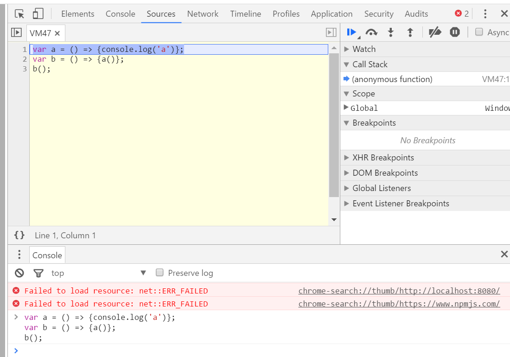
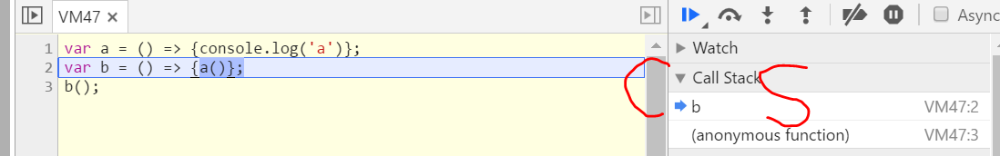
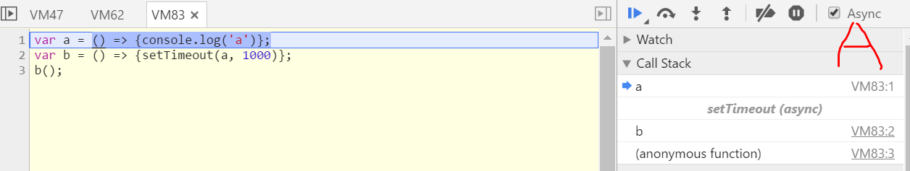

# 白话Javascript的Event Loop和Async

## 写作原因/目的
作为编程初学者，尤其是前端的编程初学者，免不了会问：什么是Javascript？Event Loop是什么？Async？Async？！Async！...  
笔者就是这样一个编程初学者，他带着上面的问题，在网上寻找着答案。本篇记录了笔者经过一番浏览之后见闻。  

## Javascript
就是`ECMAScript + environment api`（enviornment可以是浏览器或者叫web、Node.js、Photoshop、洗衣机等等）。   
`ES与api`的关系就像`自然语言和语音助手`，自然语言（ECMAScript）定义了语法、词汇，语音助手（api）定义了指令。  
比如，要开始拍照，一个语音助手要求你说“拍照”，另一个要求你说“相机”。放到Javascript里，如果要发起`http request`，在浏览器里用`new XMLHttpRequest()`，在Node.js里用`const http = require('http')`。  
DOM（如`document.addEventListener`）、BOM（如`window.setTimeout`）都是environment api。  

## Event Loop
Event loop包括`call stack + task queue + looper`（task queue和looper不是任何官方文档的名字）。  

- call stack：  
  举例说明（例1）：
  ```js
  var a = () => {console.log('a')};
  var b = () => {a()};
  b();
  ```
  在Chrome里，F12打开developer tools，先按F8（暂停脚本），在console里贴入上面代码，再按回车，状态见下图，   
    
  注意，右侧有个call stack区域。  
  然后按F11（逐步执行），头两行都是变量声明，不会进到call stack；  
  再按几下F11，路过line 3之后，call stack里出现b（那个`anonymous function`指的是整段代码），见下图。   
    
  然后`b`调用`a`，call stack里出现`a`，`a`运行完，退出call stack，`b`也结束，退出call stack。  

- task queue：  
  这个在developer tools里看不到，全靠想象。举例说明（例2）：  
  ```js
  var a = () => {console.log('a')};
  var b = () => {setTimeout(a, 1000)};
  b();
  ```
  上面的代码中的`setTimeout`（一个enviroment api），它会去到我们看不到的地方执行。  
  `a`是`setTimeout`的`callback`，即`setTimeout`在1000ms后会call `a` back。  
  在`setTimeout`被`b()`触发之后，等待1000ms，`setTimeout`把`a`添加到了task queue里，`a`不会马上进到call stack运行。`a`要等到什么时候运行呢？

- looper：  
  call stack里有代码在运行的时候，这个looper是休息着的。  
  call stack空了，looper起来，看看task queue里又没有排队的：  
  - 有的话，就把排在最前面的调到call stack里，然后looper休息。上个例子中，`a`被添加到task queue里，如果它前面没有别的任务，它就被调到call stack里运行；如果`a`前面排了别的任务，`a`就只好等一等了。  
    插一句，`setTimeout(fn, minTimeToWait)`的第二个参数是fn要等待的最小时间，可能会更长，就是因为task queue。
  - 如果task queue也空了，looper就站着等，一直等，等task queue里有排队的了，就把排在最前面的调到...  

  周而复始，如同一个loop。   

（有个名叫Philip的Roberts，做了一个可视化的event loop，叫[loupe][]，大家可以参观一下。）  

## Async
如果在developer tools里面观察上面的例2（F8暂停、粘贴、回车、F11逐步），在`b`从call stack里消失1000ms后，`a`会突然出现在call stack里，很突兀的一个`a`，并不能看出这个`a`是谁调用的。如果要看到这个`a`的来头，可以选中Async框，如图：    
  
这样，运行到`a`的时候就能知道是`b->setTimeout`调用的`a`。`setTimeout`并非call stack的一环，所以是灰色的。    
嗯，选中了Async，Async，Async。那么，Async就是：  
如果一个environment api的参数包含callback函数，那有很大可能，这个api执行的是个async操作。如果需要选中Async框才能看到这个api的存在，那么这一定是个async操作了。  
- async操作所做的就是：当一个async api在call stack里被触发后（比如`setTimeout`被`b()`触发），去到一个我们看不到的地方运行，然后在适当的时候（可能是async操作结束的时候、或是点击鼠标的时候、或是http返回的时候），把它的callback函数添加到task queue里。  
- 而sync操作就是在call stack里逐步的运行任务。  

常见的async api包括：timer（setTimeout, setInterval等等）, eventListener（onreadystatechange、onclick等等）。  

<错误>  
另外，Promise和Observable可以是sync也可以是async，主要看Promise.resolve和observer.next是谁触发的。  
</错误>  

<更正>  
Observable 在创建的时候，不会自动运行，需要使用 subscribe 方法启动。而 Observable 的运行，可以是 sync 也可以是 async，主要看 observer.callback 是谁触发的。比如：
```js
var o$ = Rx.Observable.create((observer) => {observer.next('o$ is sending out something')});
o$.subscribe(console.log); // subscribe 以后，同步触发 observer.next 
console.log('after o$.subscribe');
```
在 console 里看到：先有 'o$ is sending out something'，再有 'after o$.subscribe'。

Promise 在创建的时候，立即运行，运行的过程可以是 sync 也可以是 async，主要看 resolve 或 reject 是谁触发的。  
- （重点在这里）在Promise.prototype.then上注册的 callback 一定是被 async 执行的。比如：
```js
var p = new Promise((resolve, reject) => {
  console.log('begin');
  resolve('p is sending out something'); // 这个 resolve 是 sync 的
});
// 在 console 上立即看到 'begin'
p.then(console.log); // 这个 console.log 会被添加到 task queue，而不是直接进入到 call stack
console.log('after p.then');
```
在 console 里看到：先有 'after p.then'，再有 'p is sending out something'。  
</更正>


## 总结 
Async什么样？call stack里面看不到。  
Async什么样？添个callback到task queue。  

## 参考/推荐阅读

- [Concurrency model and Event Loop][]
- [loupe][]
- [The Node.js Event Loop, Timers, and process.nextTick()][]

Happy coding！

[Concurrency model and Event Loop]: https://developer.mozilla.org/en-US/docs/Web/JavaScript/EventLoop
[loupe]: http://latentflip.com/loupe
[The Node.js Event Loop, Timers, and process.nextTick()]: https://github.com/nodejs/node/blob/master/doc/topics/event-loop-timers-and-nexttick.md